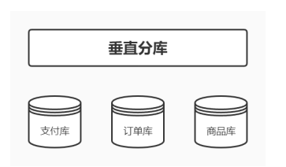
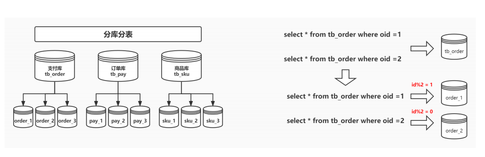
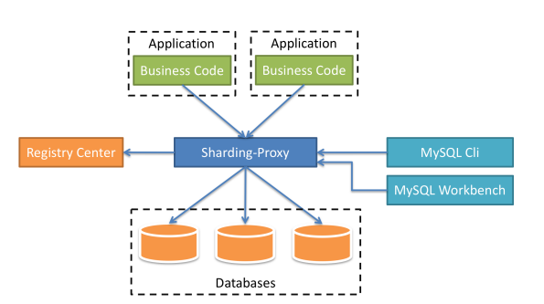
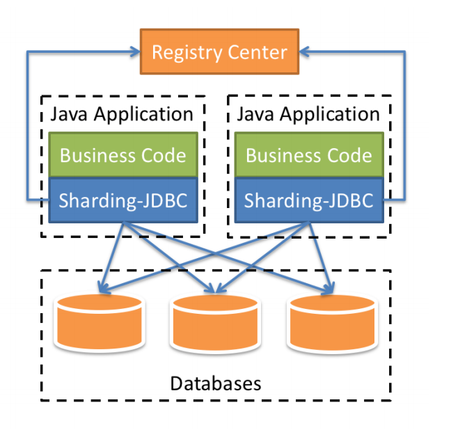
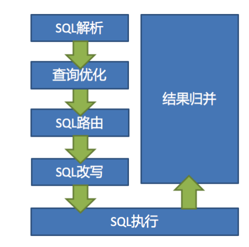

##  为什么要分库分表

关系型数据库以MySQL为例，单机的存储能力、连接数是有限的，它自身就很容易会成为系统的瓶颈。

- 当【单数据库中表的数量】达到了几百上千张表时，众多的业务模块都访问这个数据库，压力会比较大，性能和数据库可用性也在下降。
- 当【单表数据量】在百万以里时，我们还可以通过添加从库、优化索引提升性能。一旦数据量朝着千万以上趋势增长，再怎么优化数据库，很多操作性能仍下降严重。

为了减少数据库的负担，提升数据库响应速度，缩短查询时间，这时候就需要进行 分库分表 。分库分表就是要将大量数据分散到多个数据库中，使每个数据库中数据量小响应速度快，以此来提升数据库整体性能。

## 如何分库分表

- 分库分表就是要将大量数据分散到多个数据库中，使每个数据库中数据量小响应速度快，以此来提升数据库整体性能。
- 核心理念：对数据进行切分（ Sharding ），以及切分后如何对数据的快速定位与整合。
- 针对数据切分类型，大致可以分为：垂直（纵向）切分和水平（横向）切分两种。


### 垂直切分
- 垂直分片： 按照业务来对数据进行分片，又称为纵向分片，核心理念就是**专库专用**。
- 垂直切分又细分为 垂直分库 和 垂直分表

#### 垂直分库
垂直分库是基于业务分类的，和我们常听到的微服务治理观念很相似，每一个独立的服务都拥有自己的数据库，需要不同业务的数据需接口调用。而垂直分库也是按照业务分类进行划分，每个业务有独立数据库，这个比较好理解。



#### 垂直分表
- 垂直分表是基于数据表的列为依据切分的，是一种大表拆小表的模式。
- 例如：一个 order 表有很多字段，把长度较大且访问不频繁的字段，拆分出来创建一个单独的扩展表order_extend 进行存储。
- 数据库是以行为单位将数据加载到内存中，这样拆分以后核心表大多是访问频率较高的字段，而且字段长度也都较短，可以加载更多数据到内存中，增加查询的命中率，减少磁盘IO，以此来提升数据库性能。

#### 垂直切分的优点

* 业务间解耦，不同业务的数据进行独立的维护、监控、扩展
* 在高并发场景下，一定程度上缓解了数据库的压力
#### 垂直切分的缺点
* 提升了开发的复杂度，由于业务的隔离性，很多表无法直接访问，必须通过接口方式聚合数据，
* 部分表无法join，只能通过接口聚合方式解决，提升了开发的复杂度
* 分布式事务管理难度增加
* 数据库还是存在单表数据量过大的问题，并未根本上解决（需要配合水平切分）

### 水平切分

水平分片：又称横向分片。相对于垂直分片，它不再将数据根据业务逻辑分类，而是通过某个字段(或某几个字段)，根据某种规则将数据分散至多个库或表中，每个分片仅包含数据的一部分。

水平切分又分有 库内分表 和 分库分表

#### 库内分表

库内分表只解决了单一表数据量过大的问题，但没有将表分布到不同机器的库上，因此对于减轻MySQL数据库的压力来说，帮助不是很大，大家还是竞争同一个物理机的CPU、内存、网络IO，最好通过分库分表来解决。

#### 分库分表



水平分片突破了单机数据量处理的瓶颈，并且扩展相对自由是分库分表的标准解决方案。

##### 优点
* 解决高并发时单库数据量过大的问题，提升系统稳定性和负载能力
* 业务系统改造的工作量不是很大
##### 缺点
* 跨分片的事务一致性难以保证
* 跨库的join关联查询性能较差
* 扩容的难度和维护量较大

### 数据该往哪个库的表存(数据分片规则）
分库分表以后会出现一个问题，一张表会出现在多个数据库里，到底该往哪个库的表里存呢？

#### 常用的分片策略

- 取余\取模 ： 优点 均匀存放数据，缺点 扩容非常麻烦
- 按照范围分片 ： 比较好扩容， 数据分布不够均匀
- 按照时间分片 ： 比较容易将热点数据区分出来。
- 按照枚举值分片 ： 例如按地区分片
- 按照目标字段前缀指定进行分区：自定义业务规则分片

#### 根据数值范围
按照 时间区间 或 ID区间 来切分

- 举个栗子：假如我们切分的是用户表，可以定义每个库的 User表 里只存10000条数据，第一个库userId 从1 ~ 9999，第二个库10000 ~ 19999，第三个库20000~ 29999......以此类推。
- 某种意义上，某些系统中使用的"冷热数据分离"，将一些使用较少的历史数据迁移到其他库中，业务功能上只提供热点数据的查询，也是类似的实践。

##### 优点
* 单表大小可控
* 水平扩展简单只需增加节点即可，无需对其他分片的数据进行迁移
* 能快速定位要查询的数据在哪个库
##### 缺点
* 热点数据成为性能瓶颈。连续分片可能存在数据热点，例如按时间字段分片，有些分片存储最近时间段内的数据，可能会被频繁的读写，而有些分片存储的历史数据，则很少被查询

#### hash取模

- hash取模mod（对hash结果取余数 (hash() mod N)）的切分方式比较常见，还拿 User表 举例，对数据库从0到N-1进行编号，对 User表 中 userId 字段进行取模，得到余数 i ， i=0 存第一个库， i=1 存第二个库， i=2 存第三个库....以此类推。
- 这样同一个用户的数据都会存在同一个库里，用 userId 作为条件查询就很好定位了。

##### 优点
* 数据分片相对比较均匀，不易出现某个库并发访问的问题
##### 缺点
* 但这种算法存在一些问题，当某一台机器宕机，本应该落在该数据库的请求就无法得到正确的处理，这时宕掉的实例会被踢出集群，此时算法变成hash(userId) mod N-1，用户信息可能就不再在同一个库中。

## 分库分表带来的问题
### 事务一致性问题
当更新内容同时分布在不同库中，不可避免会带来跨库事务问题。跨分片事务也是分布式事务，没有简单的方案，一般可使用"XA协议"和"两阶段提交"处理。

分布式事务能最大限度保证了数据库操作的原子性。但在提交事务时需要协调多个节点，推后了提交事务的时间点，延长了事务的执行时间。导致事务在访问共享资源时发生冲突或死锁的概率增高。随着数据库节点的增多，这种趋势会越来越严重，从而成为系统在数据库层面上水平扩展的枷锁。

#### 最终一致性
对于那些性能要求很高，但对一致性要求不高的系统，往往不苛求系统的实时一致性，只要在允许的时间段内达到最终一致性即可，可采用事务补偿的方式。与事务在执行中发生错误后立即回滚的方式不同，事务补偿是一种事后检查补救的措施，一些常见的实现方法有：对数据进行对账检查，基于日志进行对比，定期同标准数据来源进行同步等等。事务补偿还要结合业务系统来考虑。

### 跨节点关联查询 join 问题
切分之前，系统中很多列表和详情页所需的数据可以通过sql join来完成。而切分之后，数据可能分布在不同的节点上，此时join带来的问题就比较麻烦了，考虑到性能，尽量避免使用join查询。

### 跨节点分页、排序、函数问题
跨节点多库进行查询时，会出现limit分页、order by排序等问题。分页需要按照指定字段进行排序，当排序字段就是分片字段时，通过分片规则就比较容易定位到指定的分片；当排序字段非分片字段时，就变得比较复杂了。需要先在不同的分片节点中将数据进行排序并返回，然后将不同分片返回的结果集进行汇总和再次排序，最终返回给用户。

### 全局主键避重问题
在分库分表环境中，由于表中数据同时存在不同数据库中，主键值平时使用的自增长将无用武之地，某个分区数据库自生成的ID无法保证全局唯一。因此需要单独设计全局主键，以避免跨库主键重复问题。有一些常见的主键生成策略：
#### UUID
UUID标准形式包含32个16进制数字，分为5段，形式为8-4-4-4-12的36个字符，例如：550e8400-e29b-41d4-a716-446655440000

UUID是主键是最简单的方案，本地生成，性能高，没有网络耗时。但缺点也很明显，由于UUID非常长，会占用大量的存储空间；另外，作为主键建立索引和基于索引进行查询时都会存在性能问题，在InnoDB下，UUID的无序性会引起数据位置频繁变动，导致分页。
#### Snowflake分布式自增ID算法
Twitter的snowflake算法解决了分布式系统生成全局ID的需求，生成64位的Long型数字，组成部分：
* 第一位未使用
* 接下来41位是毫秒级时间，41位的长度可以表示69年的时间
* 5位datacenterId，5位workerId。10位的长度最多支持部署1024个节点
* 最后12位是毫秒内的计数，12位的计数顺序号支持每个节点每毫秒产生4096个ID序列

这样的好处是：毫秒数在高位，生成的ID整体上按时间趋势递增；不依赖第三方系统，稳定性和效率较高，理论上QPS约为409.6w/s（1000*2^12），并且整个分布式系统内不会产生ID碰撞；可根据自身业务灵活分配bit位。

不足就在于：**强依赖机器时钟，如果时钟回拨，则可能导致生成ID重复。**

#### Leaf——美团点评分布式ID生成系统
* [美团点评分布式ID生成](https://tech.meituan.com/2017/04/21/mt-leaf.html "美团点评分布式ID生成")

## 分库分表的工具

**常见的分库分表工具有：**

- sharding-sphere（当当）
- MyCAT（基于Cobar）
- Atlas（奇虎360）
- Cobar（阿里巴巴）
- TSharding（蘑菇街）
- Oceanus（58同城）
- Vitess（谷歌）

### 分库分表实现核心原理

#### 基于Proxy实现



#### 基于JDBC框架实现



### ShardingSphere 

#### 什么是ShardingSphere？

- Apache ShardingSphere 是一款分布式的数据库生态系统，可以将任意数据库转换为分布式数据库，并通过数据分片、弹性伸缩、加密等能力对原有数据库进行增强。
- 由 Sharding-JDBC、Sharding-Proxy和Sharding-Sidecar 这3款相互独立，却又能够混合部署配合使用的产品组成。

#### 什么是 Sharding-Proxy？

ShardingSphere-Proxy 定位为透明化的数据库代理端，通过实现数据库二进制协议，对异构语言提供支持。 向应用程序完全透明，可直接当做 MySQL使用；适用于任何兼容 MySQL 协议的的客户端，如：MySQL Command Client, MySQL Workbench, Navicat 等。

#### 什么是Sharding-JDBC？

ShardingSphere-JDBC 是**增强版的** **JDBC** **驱动**，定位为轻量级 Java 框架，在 Java 的 JDBC 层提供的额外服务。 它使用客户端直连数据库，以 jar 包形式提供服务，无需额外部署和依赖

- 适用于任何基于 JDBC 的 ORM 框架，如：JPA、Hibernate、Mybatis、Spring JDBC Template 或直接使用 JDBC；
- 支持任何第三方的数据库连接池，如：DBCP, C3P0, BoneCP, HikariCP 等；
- 支持任意实现 JDBC 规范的数据库，目前支持 MySQL，Oracle，PostgreSQL，SQLServer 以及任何可使用 JDBC 访问的数据库

#### Sharding JDBC中的核心概念

- **逻辑表：**水平拆分的数据库（表）的相同逻辑和数据结构表的总称。
- **真实表：**在分片的数据库中真实存在的物理表。
- **数据节点：**数据分片的最小单元。由数据源名称和数据表组成。
- 绑定表：指分片规则一致的主表和子表。
  - 例如： t_order 表和 t_order_item 表，均按照 order_id 分片，则此两张表互为绑定表关系。绑定表之间的多表关联查询不会出现笛卡尔积关联，关联查询效率将大大提升。
- **广播表：**指所有的分片数据源中都存在的表，表结构和表中的数据在每个数据库中均完全一致。适用于数据量不大且需要与海量数据的表进行关联查询的场景，例如：字典表。

#### Sharding JDBC架构



数据分片主要流程是完全一致的。 核心由 SQL解析 => 执行器优化 => SQL路由 => SQL改写 => SQL执行=> 结果归并 的流程组成

#####  详细执行流程

- **SQL解析**
  - 分为**词法解析和语法解析。**
  - 先通过**词法解析器**将SQL拆分为一个个不可再分的单词。再使用**语法解析器**对SQL进行理解，并最终提炼出解析上下文。
  - 解析上下文包括：表、选择项、排序项、分组项、聚合函数、分页信息、查询条件以及可能需要修改的占位符的标记。
- **执行器优化**：合并和优化分片条件，如OR等。
- **SQL路由**：根据解析上下文匹配用户配置的分片策略，并生成路由路径。目前支持分片路由和广播路由。
- **SQL改写**：将SQL改写为在真实数据库中可以正确执行的语句。SQL改写分为正确性改写和优化改写。
- **SQL执行**：通过多线程执行器异步执行。
- **结果归并**：将多个执行结果集归并以便于通过统一的JDBC接口输出。结果归并包括流式归并、内存归并和使用装饰者模式的追加归并这几种方式。

#### Sharding JDBC分片策略

分片策略包含**分片键 和 分片算法**。分片键是用于分片的数据库字段，是将数据库(表)水平拆分的关键字段。

##### 分片算法

通过分片算法将数据分片，支持 = 、 BETWEEN AND 和 IN 分片。分片算法需要应用方开发者自行实现，实现灵活度很高。

- 精确分片算法（ PreciseShardingAlgorithm ）用于处理使用单一键作为分片键的 = 与 IN 进行分片的场景
  - 需要配合标准分片策略使用
- 范围分片算法（ RangeShardingAlgorithm ）用于处理使用单一键作为分片键的 BETWEEN AND 进行分片的场景
  - 需要配合标准分片策略使用
- 复合分片算法（ ComplexKeysShardingAlgorithm ）用于处理使用多键作为分片键进行分片的场景
  - 需要配合复合分片策略使用
- Hint分片算法（ HintShardingAlgorithm ）用于处理使用Hint行分片的场景
  - 需要配合Hint分片策略使用

##### 分片策略

- **标准分片策略**（ StandardShardingStrategy ）提供对SQL语句中的 =, IN和BETWEEN AND 的分片操作支持。
  - StandardShardingStrategy只支持 单分片键 ，提供 PreciseShardingAlgorithm 和RangeShardingAlgorithm 两个分片算法。
  - PreciseShardingAlgorithm是必选的，用于处理 = 和 IN 的分片
  - RangeShardingAlgorithm是可选的，用于处理 BETWEEN AND 分片
- **复合分片策略**（ ComplexShardingStrategy ）提供对SQL语句中的 =, IN和BETWEEN AND 的分片操作支持。
  - ComplexShardingStrategy 支持 多分片键 ，由于多分片键之间的关系复杂，因此并未进行过多的封装，而是直接将分片键值组合以及分片操作符透传至分片算法，完全由应用开发者实现，提供最大的灵活度。
- 行表达式分片策略（ InlineShardingStrategy ）使用 Groovy 的Inline表达式，提供对SQL语句中的 =和IN 的分片操作支持，
  - InlineShardingStrategy 只支持单分片键 ，对于简单的分片算法，可以通过简单的配置使用，从而避免繁琐的Java代码开发。
    - 如： t_user_${user_id % 8} 表示t_user表按照user_id按8取模分成8个表，表名称为t_user_0到t_user_7。
  - 行表达式的使用非常直观，只需要在配置中使用 ${ expression } 或 $->{ expression }标识行表达式即可。 目前支持数据节点和分片算法这两个部分的配置。
  - 行表达式的内容使用的是Groovy的语法，Groovy能够支持的所有操作，行表达式均能够支持。
- **Hint分片策略**（ HintShardingStrategy ）通过Hint而非SQL解析的方式分片的策略。
  - 对于分片字段非SQL决定，而由其他外置条件决定的场景，可使用SQL Hint灵活的注入分片字段。
  - 例：内部系统，按照员工登录主键分库，而数据库中并无此字段。
  - SQL Hint支持通过Java API和SQL注释(待实现)两种方式使用。
- **不分片的策略**（ NoneShardingStrategy ）

#### Sharding-JDBC案例：读写分离

##### 基于Spring Boot

```properties
spring.shardingsphere.datasource.names=master,slave0,slave1
# 配置主库
spring.shardingsphere.datasource.master.type=com.zaxxer.hikari.HikariDataSou
rce
spring.shardingsphere.datasource.master.driverClassName=com.mysql.cj.jdbc.Dr
iver
spring.shardingsphere.datasource.master.jdbcurl=jdbc:mysql://123.57.135.5:3306/hello?
serverTimezone=Asia/Shanghai&useUnicode=true&characterEncoding=utf-8
spring.shardingsphere.datasource.master.username=root
spring.shardingsphere.datasource.master.password=hero@202207
# 配置第一个从库
spring.shardingsphere.datasource.slave0.type=com.zaxxer.hikari.HikariDataSou
rce
spring.shardingsphere.datasource.slave0.driverClassName=com.mysql.cj.jdbc.Dr
iver
spring.shardingsphere.datasource.slave0.jdbcurl=jdbc:mysql://47.95.211.46:3306/hello?
serverTimezone=Asia/Shanghai&useUnicode=true&characterEncoding=utf-8
spring.shardingsphere.datasource.slave0.username=root
spring.shardingsphere.datasource.slave0.password=hero@202207
# 配置第二个从库
spring.shardingsphere.datasource.slave1.type=com.zaxxer.hikari.HikariDataSou
rce
spring.shardingsphere.datasource.slave1.driverClassName=com.mysql.cj.jdbc.Dr
iver
spring.shardingsphere.datasource.slave1.jdbcurl=jdbc:mysql://123.57.135.5:3306/hello?
serverTimezone=Asia/Shanghai&useUnicode=true&characterEncoding=utf-8
spring.shardingsphere.datasource.slave1.username=root
spring.shardingsphere.datasource.slave1.password=hero@202207
spring.shardingsphere.masterslave.name=ms
spring.shardingsphere.masterslave.master-data-source-name=master
spring.shardingsphere.masterslave.slave-data-source-names=slave0,slave1
# spring.shardingsphere.props.sql.show=true
```

#### Sharding-JDBC案例：实现分库分表

##### 基于Spring Boot

```properties
spring.shardingsphere.datasource.names: ds0,ds1
# 配置数据源ds0
spring.shardingsphere.datasource.ds0.type:
com.zaxxer.hikari.HikariDataSource
spring.shardingsphere.datasource.ds0.driverClassName: com.mysql.jdbc.Driver
spring.shardingsphere.datasource.ds0.jdbc-url:
jdbc:mysql://123.57.135.5:3306/ds0?
serverTimezone=Asia/Shanghai&useUnicode=true&characterEncoding=utf-8
spring.shardingsphere.datasource.ds0.username: root
spring.shardingsphere.datasource.ds0.password: hero@202207
# 配置数据源ds1
spring.shardingsphere.datasource.ds1.type:
com.zaxxer.hikari.HikariDataSource
spring.shardingsphere.datasource.ds1.driverClassName: com.mysql.jdbc.Driver
spring.shardingsphere.datasource.ds1.jdbc-url:
jdbc:mysql://47.95.211.46:3306/ds1?
serverTimezone=Asia/Shanghai&useUnicode=true&characterEncoding=utf-8
spring.shardingsphere.datasource.ds1.username: root
spring.shardingsphere.datasource.ds1.password: hero@202207
# 配置分库策略
spring.shardingsphere.sharding.default-database-strategy.inline.shardingcolumn: user_id
spring.shardingsphere.sharding.default-database-strategy.inline.algorithmexpression: ds$->{user_id % 2}
# 配置分表策略
spring.shardingsphere.sharding.tables.t_order.actual-data-nodes: ds$->{0..1}.t_order$->{0..1}
spring.shardingsphere.sharding.tables.t_order.tablestrategy.inline.sharding-column: order_id
spring.shardingsphere.sharding.tables.t_order.tablestrategy.inline.algorithm-expression: t_order$->{order_id % 2}
```


## 参考文章


* [数据库分库分表思路](https://www.cnblogs.com/butterfly100/p/9034281.html "数据库分库分表思路")
* [大众点评订单系统分库分表实践](https://tech.meituan.com/2016/11/18/dianping-order-db-sharding.html "大众点评订单系统分库分表实践")
* [ShardingSphere-JDBC](https://shardingsphere.apache.org/document/current/cn/features/sharding/ "ShardingSphere-JDBC")
* [分库分表技术演进最佳实践](https://mp.weixin.qq.com/s/3ZxGq9ZpgdjQFeD2BIJ1MA "分库分表技术演进&最佳实践")