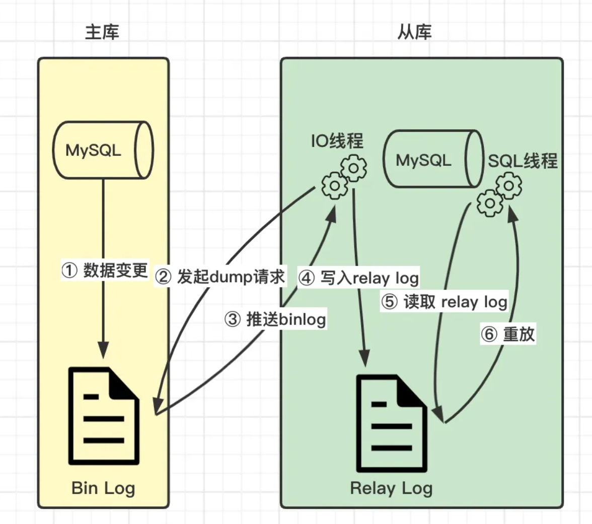
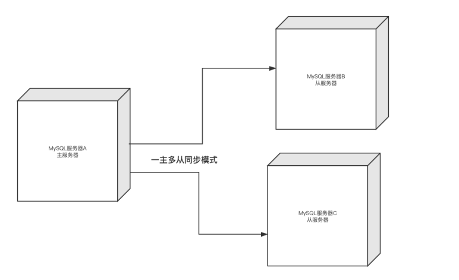

## 集群搭建之主从复制

### 主从复制作用

通过搭建MySQL主从集群，可以缓解MySQL的数据存储以及访问的压力。

1. **数据安全（主备**）：给主服务增加一个数据备份。基于这个目的，可以搭建主从架构，或者也可以基于主从架构搭建互主的架构。
2. **读写分离（主从）**：对于大部分的Java业务系统来说，都是读多写少的，读请求远远高于写请求。

​	这时，当主服务的访问压力过大时，可以将数据读请求转为由从服务来分担，主服务只负责数据写入的请求，这样大大缓解数据库的访问压力。

3. **故障转移-高可用**：当MySQL主服务宕机后，可以由一台从服务切换成为主服务，继续提供数据读写功能。

​	对于高可用架构，主从数据的同步也只是实现故障转移的一个前提条件，要实现MySQL主从切换，还需要依靠一些其他的中间件来实现。比如MMM、MHA、MGR

### 主从复制原理



MySQL服务的主从架构都是**通过 binlog 日志文件**来进行的。

#### 主从复制具体流程
1. 在主服务上打开binlog，当主库数据发生变更时，写入本地Bin Log文件
2. 从库IO线程发起dump主库Bin Log文件的请求
3. 主库IO线程推送Bin Log文件到从库中
4. 从库IO线程把Bin Log内容写入本地的Relay Log文件中
5. 从库SQL线程读取Relay Log文件内容
6. 从库SQL线程重新执行一遍SQL语句

#### 主从复制注意

1. 主从复制是异步的逻辑的 SQL 语句级的复制
2. 复制时，主库有一个 I/O 线程，从库有两个线程，即 I/O 和 SQL 线程
3. 实现主从复制的必要条件是主库要开启记录 binlog 的功能
4. 作为复制的所有 MySQL 节点的 server-id 都不能相同
5. binlog 文件只记录对数据内容有更改的 SQL 语句，不记录任何查询语句
6. 双方MySQL必须版本一致，至少需要主服务的版本低于从服务
7. 两节点间的时间需要同步

#### 主从复制形式

1. 一主一从（备份）

   

2. 主主复制

   

3. 一主多从

   

4. 多主一从

   

5. 级联复制


### binlog和relay日志

- **binlog**：二进制日志，将数据改变记录到二进制（binary）日志中，可用于本机数据恢复和主从同步。
- **relaylog**：中继日志，Slave节点会把中继日志中的事件信息一条一条的在本地执行一次，实现主从同步这个过程也叫数据重放。

#### binlog的三种模式

##### ROW模式

日志中会记录成每一行数据被修改的形式，然后在slave端再对相同的数据进行修改

- **优点**：binlog中可以**不记录执行的sql语句的上下文相关的信息**，仅仅只需要记录那一条记录被修改了，修改成什么样了。所以ROW模式的日志的内容会非常清楚的记录下每一行数据修改的细节。而且不会出现某些特定情况下的**存储过程或函数**，以及**触发器**的调用和触发无法被正确复制的问题。
- 缺点：ROW模式下，所有的执行的语句当记录到日志中的时候，都将以每行记录的修改记录，这样会产生大量的日志内容。
  - 比如：有这样一条update语句：update product set owner_member_id='d' whereowner_member_id='a'，执行之后，日志中记录的不是这条update语句所对应的事件（MySQL是以事件的形式来记录binlog日志），而是这条语句所更新的每一条记录的变化情况，这样就记录成很多条记录被更新的很多事件，自然binlog日志的量会很大。

##### Statement模式

每一条修改数据的SQL都会记录到Master的binlog中。Slave在复制的时候SQL进程会解析成和原来Master端执行过的相同的SQL来再次执行。

- **优点**：Statement模式下的优点，首先就是**解决了ROW模式下的缺点**，不需要记录每一行数据的变化，减少binlog日志量，节约io，提高性能。因为他**只需要记录在master上所执行的语句的细节，以及执行语句时候的上下文的信息。**
- **缺点**：由于它是记录的执行语句，所以为了让这些语句在Slave端也能正确执行，那么他还必须记录每条语句在执行的时候的一些相关信息，也就是上下文信息，以保证所有语句在Slave端被执行的时候能够得到和在Master端执行时候相同的结果。
  - 另外，由于MySQL现在发展比较快，很多新功能加入，使MySQL的复制遇到了不小的挑战，自然复制的时候涉及到越复杂的内容，BUG也就越容易出现。在Statement模式下，目前已经发现的就有不少情况会造成MySQL的复制出BUG，主要是修改数据的时候使用了某些特定的函数或者功能的时候会出现。
  - 比如：sleep()在有些版本就不能正确复制。

##### Mixed模式

- 实际上就是前两种模式的结合，在Mixed模式下，MySQL会根据执行的每一条具体的SQL语句来区分对待记录的日志形式，也就是在Statement和Row之间选一种。
- 新版本中的Statement模式还是和以前一样，仅仅记录执行的语句。而新版本的MySQL中对ROW模式被做了优化，并不是所有的修改都会以ROW模式来记录，像遇到表结构变更的时候就会以Statement模式来记录，如果SQL语句确实就是Update或者Delete 等修改数据的语句，那么还是会记录所有行的变更。


#### 开启binlog

修改my.cnf文件

在[mysqld]段下添加：

```shell
# binlog刷盘策略
sync_binlog=1
# 需要备份的数据库
binlog-do-db=hello
# 不需要备份的数据库
binlog-ignore-db=mysql
# 启动二进制文件
log-bin=mysql-bin
# 服务器ID
server-id=132
#只保留7天的二进制日志，以防磁盘被日志占满(可选)
expire-logs-days=7
```

sync_binlog参数：

- 0 ：存储引擎不进行binlog的刷新到磁盘，而由操作系统的文件系统控制缓存刷新。
- 1：每提交一次事务，存储引擎调用文件系统的sync操作进行一次缓存的刷新，这种方式最安全，但性能较低。
- n：当提交的日志组=n时，存储引擎调用文件系统的sync操作进行一次缓存的刷新。

sync_binlog=0或sync_binlog大于1，事务被提交，而尚未同步到磁盘。因此，在电源故障或操作系统崩、溃时有可能服务器已承诺尚未同步一些事务到二进制日志。因此它是不可能执行例行程序恢复这些事务，他们将会丢失二进制日志。

#### 调整binlog日志模式

查看binlog的日志模式：

```
show variables like 'binlog_format';
```

调整binlog的日志模式：binlog的三种格式： STATEMENT 、 ROW 、 MIXED 。

```
set binlog_format=MIXED;
```

#### 如何查看binlog和relaylog日志？

##### 方式一：使用mysqlbinlog查看binlog日志文件

因为binlog日志文件：mysql-bin.000005是二进制文件，没法用vi等打开，这时就需要mysql的自带的mysqlbinlog工具进行解码，执行： mysqlbinlog mysql-bin.000005 可以将二进制文件转为可阅读的sql语句。

```sql
mysqlbinlog --base64-output=decode-rows -v -v mysql-bin.000001 > binlog.txt
```

##### 方式二：在MySQL终端查看binlog

show master logs ，查看所有二进制日志列表 ，和 show binary logs 同义。

```sql
 show master logs;
```

使用 show binlog events 命令可以以列表的形式显示日志中的事件信息

show binlog events命令的格式：

```
show binlog events [IN 'log_name'] [FROM pos] [LIMIT [offset,] row_count];
```

说明：

- IN ‘log_name’：指定要查询的binlog文件名（如果省略此参数，则默认指定第一个binlog文件）；
- FROM pos：指定从哪个pos起始点开始查起（如果省略此参数，则从整个文件的第一个pos点开始算）；
- LIMIT【offset】：偏移量（默认为0）；
- row_count：查询总条数（如果省略，则显示所有行）。

```
show binlog events in 'mysql-bin.000001';
```

#### 切换binlog文件

```sql
 flush logs;
```

注意：刷新日志会生成一个新的日志文件

### 案例

#### 基于Pos主从复制

看示例

#### 基于GTID的主从复制

##### 什么是GTID

- 从 MySQL 5.6.5 开始新增了一种基于 GTID 的复制方式。GTID即全局事务ID （Global TransactionIdentifier），其保证每个主节点上提交的事务，在从节点可以一致性的复制。
- 这种方式强化了数据库的主备一致性，故障恢复以及容错能力。GTID在一主一从情况下没有优势，对于两主以上的结构优势异常明显，可以在数据不丢失的情况下切换新主。
- GTID实际上是由UUID+TID (即transactionId)组成的，其中UUID(即server_uuid) 产生于auto.conf文件，是一个MySQL实例的唯一标识。TID代表了该实例上已经提交的事务数量，并且随着事务提交单调递增，所以GTID能够保证每个MySQL实例事务的执行。GTID在一组复制中，全局唯一。 通过GTID的UUID可以知道这个事务在哪个实例上提交的。

##### GTID 主从复制原理


1. Master更新数据时，会在事务前产生GTID一同记录到binlog日志中

2. Slave的IO Thread将变更后的binlog写入到本地的relaylog中，这其中含有Master的GTID

3. **SQL Thread读取这个 GTID 的值并设置 GTID_NEXT变量，告诉 Slave下一个要执行的 GTID 值，然后对比 Slave 端的 binlog 是否有该 GTID**

   - **如果有，说明该 GTID 的事务已经执行 Slave 会忽略**

   - **如果没有，Slave 就会执行该 GTID 事务，并记录该 GTID 到自身的 binlog**

4. 在解析过程中会判断是否有主键，如果没有就用二级索引，如果没有二级索引就用全表扫描
5. 通过GTID可以很方便的进行复制结构上的**故障转移**

#### 其他主从集群：一主多从、互为主从

- 一主多从：**进一步提高整个集群的读能力**
- 一主多级从：**减轻主节点进行数据同步的压力**
- 多主集群：**提高整个集群的高可用能力**
- 互主集群：我们也可以扩展出互为主从的互主集群甚至是环形的主从集群，实现**多活部署**

#### 半同步复制机制

到现在为止咱们已经可以搭建MySQL的主从集群，互主集群。但是，这里的集群都有一个隐患“**会丢数据**”，为什么呢？

##### 异步复制

MySQL主从集群默认采用的是一种异步复制的机制。主服务在执行用户提交的事务后，写入binlog日志，然后就给客户端返回一个成功的响应了。而binlog会由一个dump线程异步发送给Slave从服务。由于这个发送binlog的过程是异步的。主服务在向客户端反馈执行结果时，是不知道binlog是否同步成功了的。这时候如果主服务宕机了，而从服务还没有备份到新执行的binlog，那就有可能会丢数据。


**怎么解决？**

这就要靠MySQL的**半同步复制机制**来保证数据安全

##### 半同步复制

- 半同步复制机制是一种介于异步复制和全同步复制之前的机制。
- 主库在执行完客户端提交的事务后，并不是立即返回客户端响应，而是等待至少一个从库接收并写到relaylog中，才会返回给客户端。
- MySQL在等待确认时，默认会等 10 秒，如果超过10秒没有收到ack，就会降级成为 异步复制 。


这种半同步复制相比异步复制，能够有效的提高数据的安全性。但是这种安全性也不是绝对的，他只保证事务提交后的binlog至少传输到了一个从库，且并不保证从库应用这个事务的binlog是成功的。另一方面，半同步复制机制也会造成一定程度的延迟，这个延迟时间最少是一个TCP/IP请求往返的时间。整个服务的性能是会有所下降的。而当从服务出现问题时，主服务需要等待的时间就会更长，要等到从服务的服务恢复或者请求超时才能给用户响应。

##### 搭建半同步复制集群

- 半同步复制需要基于特定的扩展模块来实现。而mysql从 5.5版本 开始，往上的版本都默认自带了这个模块。这个模块包含在mysql安装目录下的lib/plugin目录下的 semisync_master.so semisync_slave.so 两个文件中。
- 需要在主服务上安装 semisync_master 模块，在从服务上安装 semisync_slave 模块。

#### 分析主从同步延迟的原因及解决办法

##### 原因

在我们搭建的这个主从集群中，有一个比较隐藏的问题，就是这样的主从复制之间会有延迟。这在做了读写分离后，会更容易体现出来。即数据往主服务写，而读数据在从服务读。这时候这个主从复制延迟就有可能造成刚插入了数据但是查不到。当然，这在我们目前的这个集群中是很难出现的，但是在大型集群中会很容易出现。


出现这个问题的根本在于：

- Slave服务器IO Thread拉取binlog日志时，存在延迟
  - 面向业务的Master数据都是多线程并发写入的，而Slave是单个线程慢慢拉取binlog的，中间会有效率差！
- Slave服务器SQL Thread执行relaylog里面的SQL语句时，存在延迟
  - 同步到Slave后所有SQL必须都要在Slave里执行一遍，如果Master源源不断的写入， 一旦有延迟产生，那么延迟加重的可能性就会原来越大
- 注意：5.6.3 之前的IO Thread仅有一个，5.6.3之后有多线程去读，速度会大幅提升，所以主从延迟也会相对少一些

##### 解决办法

实际上主从同步延迟根本没有什么根治的办法， 只不过可以做一些缓解的措施：
1. Master负责更新对安全性的要求比从服务器高， Slave负责分散读则不需要这么高的数据安全性，所以可以这么配置
  1. Master： sync_binlog=1 ， innodb_flush_log_at_trx_commit=1 ，
  2. Slave： sync_binlog=0 ， innodb_flush_log_at_trx_commit=0 ，提升查询的效率，无需保证安全性
2. 增加Slave数量分散读的压力降低Slave的负载
3. 重写代码，插入一条数据以后，尽量不要马上去查数据，插入数据直接去更新，不要查询。如果确实存在这样的业务，必须插入数据后马上查询到，对这个查询设置直连主库
4. 开启并行复制：让Slave用多线程并行复制 binlog 数据
5. 等等

#### 如何判断主从延迟

MySQL提供了从服务器状态命令，可以通过 show slave status 进行查看， 比如可以看看**Seconds_Behind_Master**参数的值来判断，是否有发生主从延时。

其值有这么几种：

- NULL ：表示IO Thread或是SQL Thread有任何一个发生故障，也就是该线程的Running状态是No，而非Yes
- 0 ：该值为零，表示主从复制状态正常

## 集群搭建之读写分离

**读写分离的理解**


**HAC：High Availability Cluster高可用集群**

### 案例

#### Atlas配置读写分离

Atlas是由 Qihoo 360 公司Web平台部基础架构团队开发维护的一个基于MySQL协议的数据中间层项目。它在MySQL官方推出的 MySQL-Proxy 0.8.2版本 的基础上，修改了大量bug，添加了很多功能特性。该项目在360公司内部得到了广泛应用，很多MySQL业务已经接入了Atlas平台，每天承载的读写请求数达几十亿条。同时，有超过50家公司在生产环境中部署了Atlas。


#### Mycat配置读写分离

Mycat是一个数据库中间件，支持**读写分离**、分库分表、还支持水平分片与垂直分片。

- 水平分片：一个表格的数据分割到多个节点上，按照行分割
- 垂直分片：一个数据库中多个表格A，B，C，A存储到节点1上，B存储到节点2上，C存储到节点3上。


Mycat核心概念：

Mycat通过定义表的**分片规则**来实现分片，每个表格可以捆绑一个分片规则，每个分片规则指定一个分片字段并绑定一个函数，来实现动态分片算法。

- **Schema：逻辑库**与MySQL中的Database数据库对应，一个逻辑库中定义了所包括的Table。
- **Table**：表，即**物理数据库中存储的某一张表**，与传统数据库不同，这里的表格需要声明其所存储的逻辑数据节点DataNode。**在此指定表的分片规则。**
- **DataNode**：Mycat的**逻辑数据节点**，是存放table的具体物理节点，也称之为分片节点，通过DataHost来关联到后端某个具体数据库上
- **DataHost**：定义某个**物理库的访问地址**，用于捆绑到Datanode上

#### MySQL Router配置读写分离

MySQL Router最早是作为MySQL-Proxy的替代方案出现的。作为一个轻量级中间件，MySQL Router可在应用程序和后端MySQL服务器之间提供透明路由和负载均衡，从而有效提高MySQL数据库服务的高可用性与可伸缩行。

## 高可用集群解决方案：基于主从复制

### 双节点主从 + keepalived/heartbeat方案

双节点主从 + keepalived/heartbeat方案，一般来说，中小型规模的时候，采用这种架构是最省事的。两个节点可以采用简单的一主一从模式，或者双主模式，并且放置于同一个VLAN中，在Master节点发生故障后，利用keepalived/heartbeat的高可用机制实现快速切换到slave节点。

在这个方案里，有几个需要注意的地方

- **主键冲突**：把两个节点的**auto_increment_increment**（自增起始值）和**auto_increment_offset**（自增步长）设成不同值。
  - 其目的是为了避免Master节点意外宕机时，可能会有部分binlog未能及时复制到Slave上被应用，从而会导致Slave新写入数据的自增值和原先Master上冲突了，因此一开始就使其错开；也可以采用其他主键生成机制代替主键自增，例如：雪花算法。

- **热备节点（Slave）硬件配置不能低于Master节点**：Slave节点服务器配置不要太差，否则更容易导致复制延迟。
  - 如果对延迟问题很敏感的话，可考虑使用MariaDB分支版本，或者直接上线MySQL 5.7最新版本，利用多线程复制的方式可以很大程度降低复制延迟；
- **检测机制完善**：keepalived的检测机制需要适当考虑，不能仅仅只是检查mysqld进程是否存活，或者MySQL服务端口是否可通，还应该进一步做数据写入或者运算的探测，判断响应时间，如果超过设定的阈值，就可以启动切换机制；
- **数据一致性保障**：keepalived或heartbeat自身都无法解决**脑裂**的问题，因此在进行服务异常判断时，可以调整判断脚本，通过对第三方节点补充检测来决定是否进行切换，可降低**脑裂**问题产生的风险。
  - 直接切换可能因为复制延迟有些数据无法查询到而重复写入。
  - keepalived最终确定进行切换时，还需要判断slave的延迟程度。需要事先定好规则，以便决定在延迟情况下，采取直接切换或等待何种策略。

​	


### MySQL+MHA架构

> MHA目前在Mysql高可用方案中应该也是比较成熟和常见的方案，它由日本人开发出来，在mysql故障切换过程中，MHA能做到快速自动切换操作，而且还能最大限度保持数据的一致性。


该软件由两部分组成：MHA Manager（管理节点）和MHA Node（数据节点）。MHA Manager可以单独部署在一台独立的机器上管理多个master-slave集群，也可以部署在一台slave节点上。MHA Node运行在每台MySQL服务器上，MHA Manager会定时探测集群中的master节点，当master出现故障时，它可以自动将最新数据的slave提升为新的master，然后将所有其他的slave重新指向新的master。整个故障转移过程对应用程序完全透明。

在MHA自动故障切换过程中，MHA试图从宕机的主服务器上保存二进制日志，最大程度的保证数据的不丢失(配合mysql半同步复制效果更佳)，但这并不总是可行的。例如，如果主服务器硬件故障或无法通过ssh访问，MHA没法保存二进制日志，只进行故障转移而丢失了最新的数据。使用MySQL 5.5的半同步复制，可以大大降低数据丢失的风险。MHA可以与半同步复制结合起来。如果只有一个slave已经收到了最新的二进制日志，MHA可以将最新的二进制日志应用于其他所有的slave服务器上，因此可以保证所有节点的数据一致性。

注意：目前MHA主要支持一主多从的架构，要搭建MHA,要求一个复制集群中必须最少有三台数据库服务器，一主二从，即一台充当master，一台充当备用master，另外一台充当从库，因为至少需要三台服务器，出于机器成本的考虑，淘宝也在该基础上进行了改造，目前淘宝TMHA已经支持一主一从。

## 参考文章

* [浅谈MySQL集群高可用架构](https://segmentfault.com/a/1190000020200096 "浅谈MySQL集群高可用架构")
* [MySQL 同步复制及高可用方案总结](https://segmentfault.com/a/1190000022313462 "MySQL同步复制及高可用方案总结")
* [MySQL应用架构演变](https://segmentfault.com/a/1190000039693053 " MySQL应用架构演变")
* [Mysql高可用架构之keepalived and MHA ](https://kim1024.github.io/2018/11/20/mysql-keepalived-mha.html " Mysql高可用架构之keepalived and MHA ")
