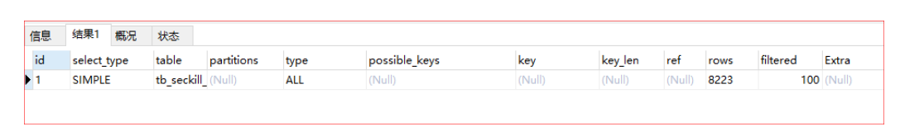
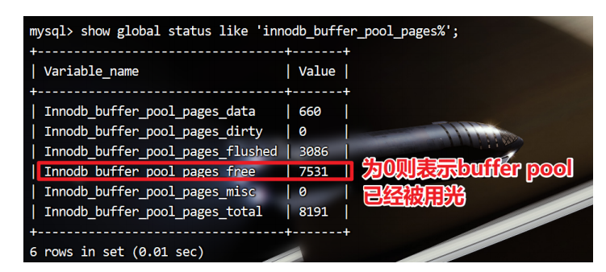

## 数据库调优原理

### 为什么要进行MySQL数据库调优

- 提升网站整体通吐量，优化用户体验数据库是关键之一

  - 流畅页面的访问速度

  - 良好的网站功能体验

  - 避免网站页面出现访问错误

    - 由于数据库连接timeout产生页面5xx错误

    - 由于慢查询造成页面无法加载

    - 由于阻塞造成数据无法提交

- 增加数据库的稳定性
  - 很多数据库问题都是由于低效的查询引起的

### 什么影响数据库性能

- 服务器： OS、CPU、memory、network

- MySQL ：

  - 数据库表结构【对性能影响最大】

  - 低下效率的SQL语句

  - 超大的表

  - 大事务

  - 数据库配置

  - 数据库整体架构（主从、读写分离）

### 数据库调优到底调什么

- 调SQL语句：根据需求创建结构良好的SQL语句【实现同一个需求，SQL语句写法很多】
  - 调索引：索引创建原则
- 调数据库表结构
- 调MySQL配置：最大连接数，连接超时，线程缓存，查询缓存，排序缓存，连接查询缓存...
- 调MySQL宿主机OS：TCP连接数，打开文件数，线程栈大小...
- 调服务器硬件：更多核CPU、更大内存
- MySQL客户端：连接池（MaxActive，MaxWait），连接属性

## 数据库压力测试

使用**JMeter**测试出数据库压力，参考实例

## 客户端-连接池

使用数据库连接池

## SQL语句优化

###  查看SQL执行计划【Explain】

MySQL 提供了一个 Explain 命令, 它可以对 SELECT 语句的执行计划进行分析，并输出 SELECT 执行的详细信息，以供开发人员针对性优化。使用explain命令来查看该SQL语句有没有使用上了索引，有没有做全表扫描等等。

**Explain 命令用法很简单, 在 SELECT 语句前加上 explain 就可以了。**

```sql
EXPLAIN SELECT * FROM tb_seckill_goods
```



- id：SELECT识别符，这是SELECT查询序列号。
- **select_type：表示单位查询的查询类型，比如：普通查询、联合查询(union、union all)、子查询等复杂查询。**
- table：表示查询的表
- partitions：使用的哪些分区（对于非分区表值为null）。
- **type（重要）表示表的连接类型。**
- possible_keys：此次查询中可能选用的索引
- key：查询真正使用到的索引
- key_len：显示MySQL决定使用的索引size
- ref：哪个字段或常数与 key 一起被使用
- **rows：显示此查询一共扫描了多少行，这个是一个估计值，不是精确的值。**
- filtered: 表示此查询条件所过滤的数据的百分比
- **Extra：额外信息**

###  关键结果说明

#### select_type

单位查询的查询类型，比如：普通查询、联合查询(union、union all)、子查询等复杂查询。

有以下几种值：
1. **simple： 普通查询**，表示不需要union操作或者不包含子查询的简单select查询。有连接查询时，外层的查询为simple。
  1. **primary： 查询的主要部分**，一个需要union操作或者含有子查询的select位于最外层的单位查询的select_type即为primary。
2. **union：连接查询**
  1. derived，在from列表中包含的子查询被标记为derived（衍生），MySQL会递归执行这些子查询，把结果放在临时表中
  2. union，若第二个select出现在union之后，则被标记为union：若union包含在from子句的子查询中，外层select将被标记为：derived 
  3. union result 从union表获取结果的select
3. **dependent union： 依赖连接查询**，与union一样出现在union 或union all语句中，但是这个查询要受到外部查询的影响
4. **subquery： 子查询**，除了from字句中包含的子查询外，其他地方出现的子查询都可能是subquery
5. **dependent subquery： 依赖子查询**，与dependent union类似，表示这个subquery的查询要受到外部表查询的影响
6. **derived：派生表**， from字句中出现的子查询，也叫做派生表，其他数据库中可能叫做内联视图或嵌套select

#### type

显示的是单位查询的**连接类型**或者理解为**访问类型**，访问性能依次从好到差：

```sql
system
const
eq_ref
ref
fulltext
ref_or_null
unique_subquery
index_subquery
range
index_merge
index
ALL
```

1. **system**：表中**只有一行数据或者是空表**。等于系统表，这是const类型的特列，平时不会出现，可以忽略不计
2. **const（重要**）：使用**唯一索引或者主键**，返回记录一定是1行记录的等值where条件时，通常type是const。其他数据库也叫做唯一索引扫描。
3. **eq_ref（重要）**：**唯一性索引扫描**，对于每个索引键，表中只有一条记录与之匹配。
4. **ref（重要**）：非唯一性索引扫描，返回匹配某个单独值的所有行，本质上也是一种索引访问，它返回所有匹配某个单独值的行，然而，它可能会找到多个符合条件的行，所以他应该属于查找和扫描的混合体。
  1. 组合索引
  2. 非唯一索引
5. **fulltext**：全文索引检索，要注意，全文索引的优先级很高，若全文索引和普通索引同时存在时，mysql不管代价，优先选择使用全文索引
6. **ref_or_null**：与ref方法类似，只是增加了null值的比较。实际用的不多。
7. **unique_subquery**：用于where中的in形式子查询，子查询返回不重复值唯一值
8. **index_subquery**：用于in形式子查询使用到了辅助索引或者in常数列表，子查询可能返回重复值，可以使用索引将子查询去重。
9. **range（重要）**：**索引范围扫描**，常见于使用>,<,is null,between ,in ,like等运算符的查询中。
10. **index_merge**：表示查询使用了两个以上的索引，最后取交集或者并集，常见and ，or的条件使用了不同的索引，官方排序这个在ref_or_null之后，但是实际上由于要读取所有索引，性能可能大部分时间都不如range
11. index（重要）：select结果列中使用到了索引，type会显示为index。**全部索引扫描**，把索引从头到尾扫一遍，常见于使用索引列就可以处理不需要读取数据文件的查询、可以使用索引排序或者分组的查询。
12. **all（重要）**：这个就是全表扫描数据文件，然后再**在server层进行过滤**返回符合要求的记录。

##### 注意事项

除了all之外，其他的type都可以使用到索引

最少要使用到range级别

```sql
-- const 使用唯一索引或者主键，返回记录一定是1行记录的等值where条件时，
-- 通常type是const。其他数据库也叫做唯一索引扫描。
explain select * from tb_seckill_goods where id=1;
-- eq-ref 唯一性索引扫描，对于每个索引键，表中只有一条记录与之匹配。
-- 常见于主键或唯一索引扫描
explain select * from tb_seckill_goods a left join tb_seckill_goods b on
a.id=b.id;
-- ref 非唯一性索引扫描，返回匹配某个单独值的所有行
-- 本质上也是一种索引访问，它返回所有匹配某个单独值的行，
-- 然而，它可能会找到多个符合条件的行，所以他应该属于查找和扫描的混合体。
-- 组合索引
explain select * from tb_seckill_goods where title="华为5G手机";
explain select * from tb_seckill_goods a left join tb_seckill_goods b on a.title=b.title;
-- 非唯一索引
explain select * from tb_seckill_goods where price=5346.94;
-- range 索引范围扫描，常见于使用>,<,is null,between ,in ,like等运算符的查询中。
explain select * from tb_seckill_goods where title like '华为%';
-- index 查询结果列中使用到了索引，type会显示为index。
-- 全部索引扫描，把索引从头到尾扫一遍，
-- 常见于使用索引列就可以处理不需要读取数据文件的查询、可以使用索引排序或者分组的查询。
explain select title from tb_seckill_goods;
-- all 这个就是全表扫描数据文件，然后再在server层进行过滤返回符合要求的记录。
explain select * from tb_seckill_goods;
```

#### Extra

这个列包含不适合在其他列中显示的，但十分重要的额外的信息，这个列可以显示的信息非常多，有几十种。

关注几个经常遇到的

##### Using filesort

使用了文件排序，说明mysql会对数据使用一个外部的索引排序，而不是按照表内的索引顺序进行读取。MySQL中无法利用索引完成的排序操作称为“文件排序”。**这种操作需要优化sql**。

```sql
-- 无索引，按照文件排序
explain select price from tb_seckill_goods where price >100 order by
cost_price;
-- 有索引，不按照文件排序
explain select price from tb_seckill_goods where price >100 order by price;
```

##### Using index

表示相应的SELECT查询中使用到了索引，避免访问表的数据行，这种查询的效率很高！

- 如果同时出现Using Where ，索引在where之后，用作查询条件
- 如果没有同时出现Using Where ，索引在where之前，用作查询结果读取

```sql
-- 使用where，索引在where之后，用作查询条件
explain select id,title,price from tb_seckill_goods where price>100;
-- 没有使用where，索引在where之前，用作查询结果读取
explain select id,title,price from tb_seckill_goods;
```

##### Using where

表示MySQL将对InnoDB提取的结果在SQL Layer层进行过滤，过滤条件字段无索引；

```sql
-- 只有where
explain select * from tb_seckill_goods where cost_price>100;
```

##### Using join buffer

表明使用了连接缓存，比如说在查询的时候，多表join的次数非常多，那么将配置文件中的缓冲区的join buffer调大一些。


### 索引优化

#### 什么情况下需要创建索引

1. 频繁出现在where 条件字段，order排序，group by分组字段
2. select 频繁查询的列，考虑是否需要创建联合索引（覆盖索引，不回表）
3. 多表join关联查询，on字段两边的字段都要创建索引

#### 索引优化建议

1. **表记录很少不需创建索引 ： **索引是要有存储的开销

2. **一个表的索引个数不能过多：**

   - （1）空间：浪费空间。每个索引都是一个索引树，占据大量的磁盘空间。

   - （2）时间：更新（插入/Delete/Update）变慢。需要更新所有的索引树。太多的索引也会增加优化器的选择时间。

​	所以索引虽然能够提高查询效率，索引并不是越多越好，应该只为需要的列创建索引。

3. **频繁更新的字段不建议作为索引：** 频繁更新的字段引发频繁的页分裂和页合并，性能消耗比较高。

4. **区分度低的字段，不建议建索引：**
   比如性别，男，女；比如状态。区分度太低时，会导致扫描行数过多，再加上回表查询的消耗。如果使用索引，比全表扫描的性能还要差。这些字段一般会用在组合索引中。

   姓名，手机号就非常适合建索引

5. **在InnoDB存储引擎中，主键索引建议使用自增的长整型，避免使用很长的字段：**
   主键索引树一个页节点是16K，主键字段越长，一个页可存储的数据量就会越少，比较臃肿，查询时尤其是区间查询时磁盘IO次数会增多。辅助索引树上叶子节点存储的数据是主键值，主键值越长，一个页可存储的数据量就会越少，查询时磁盘IO次数会增多，查询效率会降低。

6. **不建议用无序的值作为索引：** 例如身份证、UUID。更新数据时会发生频繁的页分裂，页内数据不紧凑，浪费磁盘空间。

7. **尽量创建组合索引，而不是单列索引：**

   - 优点

     1. 1个组合索引等同于多个索引效果，节省空间。

     2. 可以使用覆盖索引

   - 创建原则：组合索引应该把频繁用到的列、区分度高的值放在前面。**频繁使用代表索引的利用率高，区分度高代表筛选粒度大**，这样做可最大限度利用索引价值，缩小筛选范围

####  索引失效-组合索引心法口诀

全值匹配我最爱，最左前缀要遵守；

带头大哥不能死，中间兄弟不能断；

索引列上不计算，范围之后全失效；

Like百分写最右，覆盖索引不写星；

不等空值还有OR，索引失效要少用。

#### 建议

* 不在索引列上做任何操作（计算、函数、(自动or手动)类型转换），会导致索引失效而转向全表扫描
* 存储引擎不能使用索引中范围条件右边的列
* 尽量使用覆盖索引(只访问索引的查询(索引列和查询列一致))，减少select *
* is null ,is not null 也无法使用索引
* like "xxxx%" 是可以用到索引的，like "%xxxx" 则不行(like "%xxx%" 同理)。like以通配符开头('%abc...')索引失效会变成全表扫描的操作，
* 字符串不加单引号索引失效
* 少用or，用它来连接时会索引失效
* <，<=，=，>，>=，BETWEEN，IN 可用到索引，<>，not in ，!= 则不行，会导致全表扫描

### LIMIT优化

如果预计SELECT语句的查询结果是一条，最好使用 **LIMIT 1**，可以停止全表扫描。

```sql
SELECT * FROM user WHERE username=’it雄’; -- username没有建立唯一索引
SELECT * FROM user WHERE username=’it雄’ LIMIT 1;
```

处理分页会使用到 LIMIT ，当翻页到非常靠后的页面的时候，偏移量会非常大，这时LIMIT的效率会非常差。 LIMIT OFFSET , SIZE；

LIMIT的优化问题，其实是 OFFSET 的问题，它会导致MySQL扫描大量不需要的行然后再抛弃掉。

解决方案：单表分页时，使用自增主键排序之后，先使用where条件 id > offset值，limit后面只写rows

```sql
select * from (select * from tuser2 where id > 1000000 and id < 1000500 ORDERBY id) t limit 0, 20
```

### 子查询优化

MySQL从4.1版本开始支持子查询，使用子查询进行SELECT语句嵌套查询，可以一次完成很多逻辑上需要多个步骤才能完成的SQL操作。子查询虽然很灵活，但是执行效率并不高。

把内层查询结果当作外层查询的比较条件的

```
select goods_id,goods_name from goods where goods_id = (select max(goods_id)from goods);
```

执行子查询时，MYSQL需要**创建临时表**，查询完毕后再删除这些临时表，所以子查询的速度会受到一定的影响。这多了一个创建临时表和销毁表的过程。

**优化方式：可以使用连接查询（JOIN）代替子查询，连接查询时不需要建立临时表，其速度比子查询、快。**

### 其他查询优化

- **小表驱动大表**：建议使用left join时，以小表关联大表，因为使用join的话，第一张表是必须全扫描的，以少关联多就可以减少这个扫描次数。

- JOIN两张表的关联字段最好都建立索引，而且最好字段类型一致

  ```sql
  SELECT * FROM orders o LEFT JOIN user u on o.user_id = u.id
  -- orders表中的user_id和user表中的id，类型要一致
  ```

  

- **避免全表扫描**：注意索引失效的口诀，避免索引失效导致的全表扫描

- 避免MySQL放弃索引：如果MySQL估计使用全表扫描要比使用索引快，则不使用索引。

  - 最典型场景：查询数据量到一定阈值的时候出现的索引失效，数据量达到一定阈值使用索引不如全表扫描来的更快！

- **WHERE条件中尽量不要使用not in语句，建议使用not exists**

- **利用慢查询日志、explain执行计划查询、show profile查看SQL执行时的资源使用情况**

#### 查询优化

* ORDER BY关键字优化
  * ORDER BY子句，尽量使用 Index 方式排序，避免使用 FileSort 方式排序
  * MySQL 支持两种方式的排序，FileSort 和 Index，Index效率高，它指 MySQL 扫描索引本身完成排序，FileSort 效率较低；
  * ORDER BY 满足两种情况，会使用Index方式排序；①ORDER BY语句使用索引最左前列 ②使用where子句与ORDER BY子句条件列组合满足索引最左前列
  * 尽可能在索引列上完成排序操作，遵照索引建的最佳左前缀
  * 如果不在索引列上，filesort 有两种算法，mysql就要启动双路排序和单路排序
  * 双路排序：MySQL 4.1之前是使用双路排序,字面意思就是两次扫描磁盘，最终得到数据
  * 单路排序：从磁盘读取查询需要的所有列，按照ORDER BY 列在 buffer对它们进行排序，然后扫描排序后的列表进行输出，效率高于双路排序
  * 优化策略
    * 增大sort_buffer_size参数的设置
    * 增大max_length_for_sort_data 参数的设置
* GROUP BY关键字优化
  * group by实质是先排序后进行分组，遵照索引建的最佳左前缀
  * 当无法使用索引列，增大 max_length_for_sort_data 参数的设置，增大sort_buffer_size参数的设置
  * where高于having，能写在where限定的条件就不要去having限定了

### 数据类型优化

MySQL 支持的数据类型非常多，选择正确的数据类型对于获取高性能至关重要。不管存储哪种类型的数据，下面几个简单的原则都有助于做出更好的选择。

* 更小的通常更好：一般情况下，应该尽量使用可以正确存储数据的最小数据类型。
* 简单就好：简单的数据类型通常需要更少的CPU周期。例如，整数比字符操作代价更低，因为字符集和校对规则（排序规则）使字符比较比整型比较复杂。
* 尽量避免NULL：通常情况下最好指定列为NOT NULL

### 在SQL优化实战中的三剑客

**慢查询日志 --> explain --> show profile**


### SQL语句性能分析

Query Profiler是MySQL自带的一种**Query诊断分析工具**，通过它可以分析出一条SQL语句的**硬件性能瓶颈**在什么地方。**通常我们是使用的explain，以及slow query log都无法做到精确分析，但是QueryProfiler却可以定位出一条SQL语句执行的各种资源消耗情况，比如CPU，IO等，以及该SQL执行所耗费的时间等。**


不过该工具只有在MySQL 5.0.37以及以上版本中才有实现。**默认的情况下，MySQL的该功能没有打开，需要自己手动启动。**

#### 开启Profile功能

```sql
-- 查看是否开启了Profile功能:
select @@profiling;
-- 或者
show variables like '%profil%';

-- 开启profile功能
-- 1是开启、0是关闭
set profiling=1;
```

#### 基本使用

```sql
SHOW PROFILE [type [, type] ... ]
    [FOR QUERY n]
    [LIMIT row_count [OFFSET offset]]
type: {
    ALL
    | BLOCK IO
    | CONTEXT SWITCHES
    | CPU
    | IPC
    | MEMORY
    | PAGE FAULTS
    | SOURCE
    | SWAPS
}
```

**show profile** 和 **show profiles** 语句可以展示**当前会话**(退出session后,profiling重置为0) 中执行语句的资源使用情况.

**show profiles** :以列表形式显示最近发送到服务器上执行的语句的**资源使用情况**，显示的记录数由变量:*profiling_history_size* 控制,默认15条 

**show profile**: 展示最近一条语句执行的详细资源占用信息,默认显示 **Status和Duration**两列 

**show profile** 还可根据 show profiles 列表中的 **Query_ID** ,选择显示某条记录的性能分析信息

```sql
-- 查看某条SQL的性能分析信息
show profile for query 1;
-- 查看某条SQL的具体某个指标的性能分析
show profile cpu for query 1;
```

type是可选的，取值范围可以如下：

- ALL 显示所有性能信息
- BLOCK IO 显示块IO操作的次数
- CONTEXT SWITCHES 显示上下文切换次数，不管是主动还是被动
- CPU 显示用户CPU时间、系统CPU时间
- IPC 显示发送和接收的消息数量
- MEMORY [暂未实现]
- PAGE FAULTS 显示页错误数量
- SOURCE 显示源码中的函数名称与位置
- SWAPS 显示SWAP的次数

## 数据库优化

**如何发现复杂的SQL有问题？**

一个个去explain吗？你有没有这样的困惑，开发代码运行顺畅丝滑，上生产了却卡的一逼？

```sql
# 举个栗子：查询218秒
explain select tk.id,ts.* from tb_seckill_goods ts LEFT JOIN tb_sku tk ON
tk.id=ts.id where ts.id>100 order by ts.price;
# 举个栗子：查询2秒
select sleep(2);
```

### 慢查询日志

- 数据库性能问题，根据经验来说，**80%以上都是由于慢SQL造成的。**
- 数据库查询快慢是影响项目性能的一大因素，对于数据库，我们除了要优化 SQL，更重要的是得先找到需要优化的SQL。
- MySQL数据库“**慢查询日志**”功能，用来记录查询时间超过某个设定值的SQL语句，这将极大程度帮助我们快速定位到症结所在，以便对症下药。至于查询时间的多少才算慢，每个项目、业务都有不同的要求。
- MySQL的慢查询日志功能默认是关闭的，需要手动开启。

####  开启慢查询日志

**查看是否开启慢查询功能**

```sql
# 查看是否开启慢查询日志
show variables like '%slow_query%';
show variables like 'long_query_time%';
```

- slow_query_log：是否开启慢查询日志，1为开启，0为关闭
- log-slow-queries：旧版（5.6以下）MySQL数据库慢查询日志存储路径。
- slow-query-log-file：新版（5.6及以上）MySQL数据库慢查询日志存储路径。
  - 不设置该参数，系统则会默认给一个文件host_name-slow.log
- long_query_time：慢查询阈值，当查询时间多于设定的阈值时，记录日志，单位秒

**开启慢查询功能**

注意：打开慢查询日志可能会对系统性能有一点点影响，如果你的MySQL是主从结构，可以考虑打开其中一台从服务器的慢查询日志，这样既可以监控慢查询，对系统性能影响又小。

```sql
# 开启慢查询日志
set global slow_query_log=on;
# 大于1秒钟的数据记录到慢日志中，如果设置为默认0，则会有大量的信息存储在磁盘中，磁盘很容易满
掉
# 如果设置不生效，建议配置在my.cnf配置文件中
set global long_query_time=1;
# 记录没有索引的查询。
set global log_queries_not_using_indexes=on;
```

#### 慢查询日志格式

```sql
# Time: 2021-07-27T08:32:44.023309Z
# User@Host: root[root] @ [172.26.233.201] Id: 1243
# Query_time: 218.295526 Lock_time: 0.000126 Rows_sent: 10959
Rows_examined: 10929597
use hero_all;
SET timestamp=1627374764;
# 慢查询SQL语句
select tk.id,ts.* from tb_seckill_goods ts LEFT JOIN tb_sku tk ON
tk.id=ts.id where ts.id>100 order by ts.price;
```

日志解析：

第一行：SQL查询执行的具体时间

第二行：执行SQL查询的连接信息，用户和连接IP

第三行：记录了一些我们比较有用的信息，如下解析

```txt
Query_time,这条SQL执行的时间,越长则越慢
Lock_time,在MySQL服务器阶段(不是在存储引擎阶段)等待表锁时间
Rows_sent,查询返回的行数
Rows_examined,查询检查的行数，越长就当然越费时间
```

- 第四行：设置时间戳，没有实际意义，只是和第一行对应执行时间。
- 第五行及后面所有行是执行的SQL语句，SQL可能会很长。截止到下一个# Time:之前

#### 分析慢查询日志工具

使用mysqldumpslow工具，mysqldumpslow是MySQL自带的慢查询日志工具。可以使用mysqldumpslow工具搜索慢查询日志中的SQL语句。

得到按照时间排序的前10条里面含有左连接的查询语句：

```shell
mysqldumpslow -s t -t 10 -g "left join" /var/lib/mysql/slow.log
```


###  连接数max_connections


**同时连接客户端的最大数量，默认值 151，最小值1.**

连接数导致问题**：ERROR 1040，TooManyConnections原因如下**

- 第一：MySQL的max_connection配置少了
- 第二：访问确实太高，MySQL有点扛不住了，考虑扩容
- **第三：你的连接池配置有误，MaxActive为0**

```sql
# 查看 max_connections
show global variables like 'max_connections'
# 设置 max_connections（立即生效重启后失效）
set global max_connections = 800;
# 这台MySQL服务器最大连接数是256，然后查询一下服务器使用过的最大连接数：
show global status like 'Max_used_connections';
# MySQL服务器过去的最大连接数是245，没有达到服务器连接数上限256，应该没有出现1040错误，
比较理想的设置是：Max_used_connections / max_connections * 100% ≈ 85%
最大连接数占上限连接数的85%左右，如果发现比例在10%以下，MySQL服务器连接数上限设置的过高
了。
```

**Max_connection可以无限大吗**

MySQL支持的最大连接数取决于如下几个主要因素

- 可使用内存
- 每个连接占用的内存
- 连接响应时间

**Max_connection大了会影响系统的通吐能力？**

- 一般情况下，Linux操作系统支持最大连接数范围500-1000之间，最大链接数上限10w。如果想设置为最大，要么你得有足够的资源，要么就是你可以接收很长的响应时间。

- 建议设置：最大连接数占上限连接数的85%左右，如果发现比例在10%以下，MySQL服务器连接数上限设置的过高了。

  ```txt
  MySQL服务器过去的最大连接数是245，没有达到服务器连接数上限256，应该不会出现1040错误
  比较理想的设置是：Max_used_connections / max_connections * 100% ≈ 85%
  ```

  

### 线程使用情况

- 如果我们在MySQL服务器配置文件中设置了thread_cache_size，当客户端断开之后，服务器处理此客户的线程将会缓存起来以响应下一个客户而不是销毁（前提是缓存数未达上限）。
- 根据测试发现，以上服务器线程缓存thread_cache_size没有进行设置或者设置过小，MySQL服务器一直在创建线程销毁线程。增加这个值可以改善系统性能（**可以使得RT更趋于平稳**）。
- 通过比较 Connections 和 Threads_created 状态的变量，可以看到这个变量的作用。

- Threads_created表示创建过的线程数，如果发现**Threads_created值过大**的话，表明MySQL服务器一直在创建线程，这也是比较耗资源，可以适当增加配置文件中thread_cache_size值，查询服务器thread_cache_size配置：

```sql
# 查询线程使用情况
show global status like 'Thread%';
# 查询线程缓存
show variables like 'thread_cache_size';
# 增加thread_cache_size的值
set global thread_cache_size = 64;
```

根据物理内存建议设置规则如下：

- 1G ---> 8
- 2G ---> 16
- 3G ---> 32
- 大于3G ---> 64

### 数据库优化-结构优化

- 一个好的数据库设计方案对于数据库的性能往往会起到事半功倍的效果。
- 这句话是什么意思呢？就是说我们的数据库优化不仅仅要局限于查询优化，要从这块跳出来做好最开始的设计优化，如果你这个主要设计是不合理的这些个查询优化效果也只是杯水车薪。
- 需要考虑数据冗余、查询和更新的速度、字段的数据类型是否合理等多方面的内容。

#### 将字段很多的表分解成多个表（分表）

- 对于字段较多的表，如果有些字段的使用频率很低，可以将这些字段分离出来形成新表。因为当一个表的数据量很大时，会由于使用频率低的字段的存在而变慢。
- 项目实战的时候会将一个完全信息的表里面的数据拆分出来 形成多个新表 每个新表负责那一块的数据查询。

#### 增加中间表

- 对于需要经常联合查询的表，可以建立中间表以提高查询效率。通过建立中间表，将需要通过联合查询的数据插入到中间表中，然后将原来的联合查询改为对中间表的查询。
- 通常都是在统计当中使用，每次统计报表的时候都是离线统计，后台有有一个线程对你这统计查询结果放入一个中间表，然后你对这个中间表查询。

***举个栗子：比如我们需要五张表联查，left join每次要查询5张表，如果我们做了一个中间表，把这五张表的查询结果放在这里面，直接查询这个表，是不是就变成了单表查询呀？妙哉***

#### 增加冗余字段

- 设计数据表时应尽量遵循关系数据库范式的规约，尽可能的减少冗余字段，让数据库设计看起来精致、优雅。但是合理的加入冗余字段可以提高查询速度。
- 表的规范化程度越高，表和表之间的关系越多，需要连接查询的情况也就越多，性能也就越差。
- 注意：冗余字段的值在一个表中修改了，就要想办法在其他表中更新，否则就会导致数据不一致的问题。

## 服务器层面优化

### 缓冲区优化

将数据保存在内存中，保证从内存读取数据

- 设置足够大的 innodb_buffer_pool_size ，将数据读取到内存中，推荐设置为物理内存的50%~80%。
- 怎样确定足够大。
- 数据是从内存读取而不是硬盘IO读取？

```sql
show global status like 'innodb_buffer_pool_pages%';
```



### 降低磁盘写入次数

- 对于生产环境来说，很多日志是不需要开启的，比如：**通用查询日志、慢查询日志、错误日志**
- 使用足够大的写入缓存
- 设置合适日志落盘策略

### MySQL数据库配置优化

MySQL的配置参数都在my.conf或者my.ini文件的[mysqld]组中，常用参数汇总如下：

```yaml
# 01-缓冲区，将数据保存在内存中，保证从内存读取数据。推荐值为总物理内存的50%~80%。
innodb_buffer_pool_size=
# 02-日志组（Redo）中每个日志文件的大小，默认48MB，日志文件越大越节省磁盘IO，但需要注意
日志文件变大增加崩溃恢复时间
innodb_log_file_size=48
# 03-用来控制Redo日志刷新到磁盘的策略。
innodb_flush_log_at_trx_commit=1
# 04-每提交1次事务同步写到磁盘中，可以设置为n。
sync_binlog=1
# 05-脏页占innodb_buffer_pool_size的比例时，触发刷脏页到磁盘。推荐值为25%~50%。
innodb_max_dirty_pages_pct=30
# 06-后台进程最大IO性能指标。默认200，如果SSD，调整为5000~20000
innodb_io_capacity=200
# 07-指定innodb共享表空间文件及大小。
innodb_data_file_path=
# 08-慢查询日志的阈值设置，单位秒。
long_qurey_time=3
# 09-MySQL的binlog复制的形式，MySQL8.0默认为row
binlog_format=row
# 10-同时连接客户端的最大数量
max_connections=200
# 11-全量日志建议关闭。默认关闭。
general_log=0
```


### 服务器硬件优化

提升硬件设备，例如选择**尽量高频率的内存**（频率不能高于主板的支持）、提升**网络带宽**、使用SSD高速磁盘、提升**CPU性能**等。

CPU的选择:

- 对于数据库并发比较高的场景，CPU的数量比频率重要。
- 对于CPU密集型场景和频繁执行复杂SQL的场景，CPU的频率越高越好。


## 参考文章
* [MySQL调优](https://juejin.cn/post/6850037271233331208#heading-54 "MySQL调优")