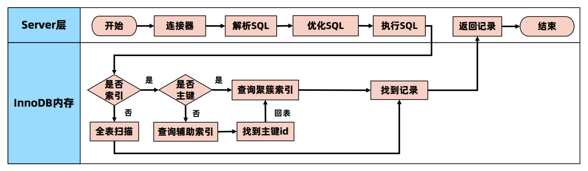
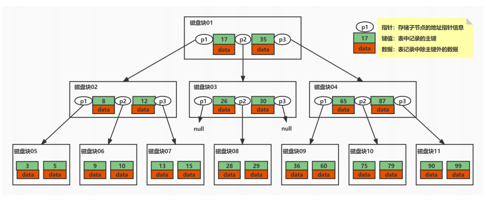
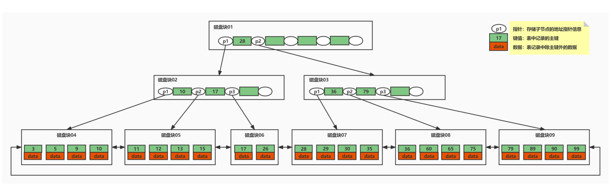
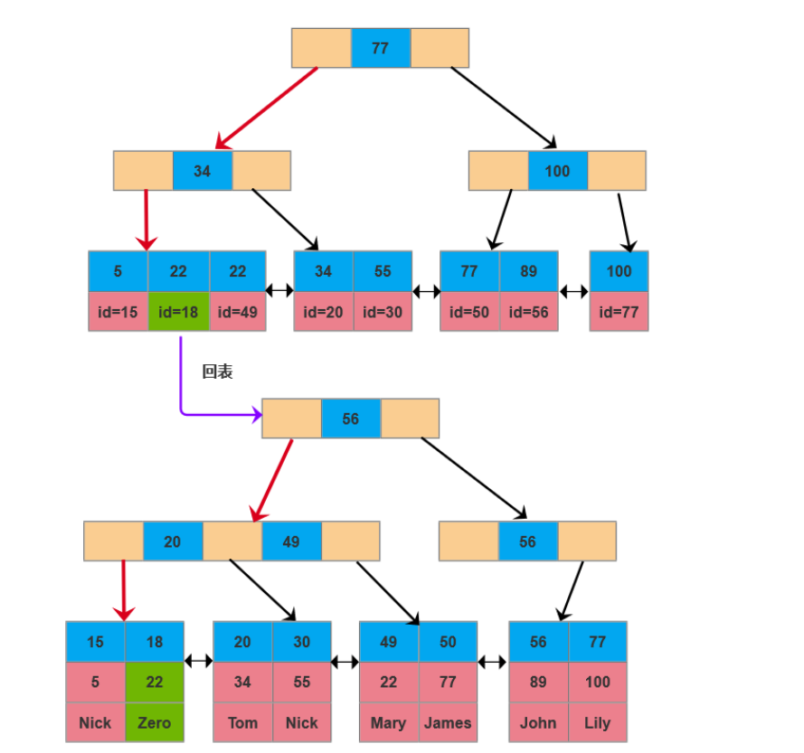
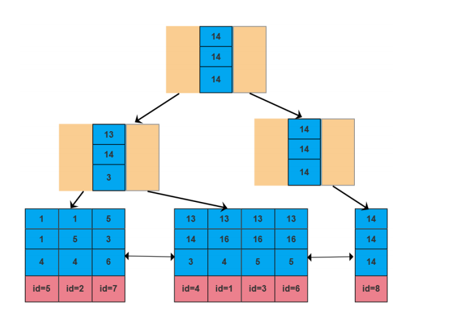
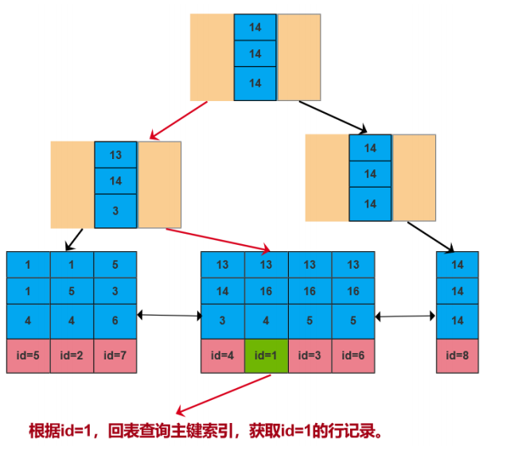
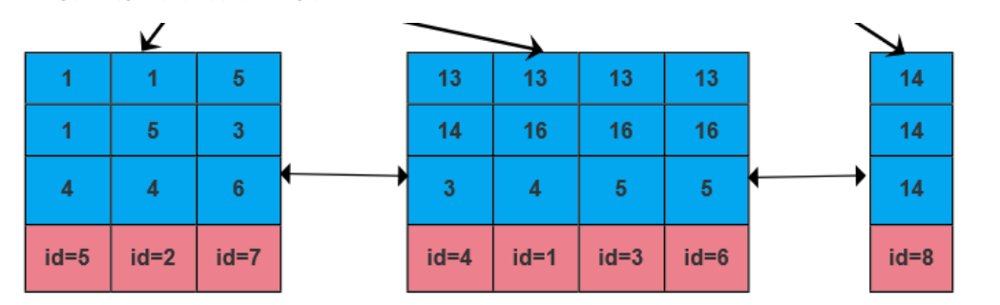
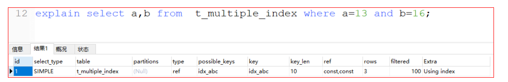

## 索引简介

### 什么是索引

-  索引是数据库 **高效获取数据的数据结构**，加快查询速度，索引一般存储在表空间中，也就是磁盘里
-  常见索引：聚簇索引、覆盖索引、组合索引、前缀索引、唯一索引等
-  没有特别说明，**索引一般特指B+树组织结构**

### 优势与劣势

#### 优势

- **两降一升**，降低磁盘IO频次、降低数据排序的成本，提高数据检索效率

- 通过**索引列对数据进行排序**，降低数据排序的成本，降低了CPU的消耗。

  -  被索引列会自动排序【B+树叶子节点的有序特性】，包括【单列索引】和【组合索引】，只是组合索引的排序要复杂一些。

  -  如果Order By的字段使用索引，效率会高特别多

#### 劣势

- 占用更多磁盘空间（空间换时间）
- **索引虽然会提高查询效率，但是会降低更新表的效率**。比如每次对表进行增删改操作，MySQL不仅要保存数据，还要维护索引文件

##  一条Select语句的执行流程



## 索引基本使用

### 索引类型，按照数量分类

-  单列索引：索引中只有一个列
-  组合索引：使用2个以上的字段创建的索引

### 单列索引按类型细分

-  主键索引：索引列中的值必须是唯一的不允许有空值。

  ```sql
  ALTER TABLE table_name ADD PRIMARY KEY (column_name);
  ```

-  唯一索引：索引列中的值必须是唯一的，但是允许为空值。

  ```sql
  CREATE UNIQUE INDEX index_name ON table(column_name);
  ```

-  普通索引：MySQL中基本索引类型，没有什么限制，允许在定义索引的列中插入重复值和空值。

  ```sql
  ALTER TABLE table_name ADD INDEX index_name (column_name);
  ```

-  全文索引：支持全文搜索的索引，只能对文本类型字段设置，不建议使用

  ```sql
  ALTER TABLE `t_fulltext` ADD FULLTEXT INDEX `idx_content`(`content`);
  ```


-  前缀索引：用字段的一部分建立索引

  ```sql
  ALTER TABLE table_name ADD INDEX index_name (column1(length));
  ```

-  空间索引：5.7版支持空间索引，而且支持OpenGIS几何数据模型

### 组合索引

- 组合索引的使用，需要遵循**最左前缀原则（最左匹配原则，后面详细讲解）**。

- 一般情况下，**建议使用组合索引代替单列索引**（主键索引除外，具体原因后面讲解）。

  ```sql
  ALTER TABLE table_name ADD INDEX index_name (column1,column2);
  ```
### 删除索引

```sql
DROP INDEX index_name ON table
```

###  查看索引

```sql
SHOW INDEX FROM table_name
```

## 索引的数据结构

### 使用索引的基本需求

- 至少需要支持两种最常用的查询需求

  -  等值查询：根据某个值查找数据

  -  范围查询：根据某个范围区间查找数据

  -  排序Order By

  -  分组Group By

- **性价比：**时间与空间

  -  执行时间方面：查询时间尽可能短

  -  存储空间方面：我们希望索引不要消耗太多的内存空间和磁盘空间

### 可选的数据结构对比分析

  Hash表，二叉树，平衡二叉查找树（红黑树是一个近似平衡二叉树），B树，B+树

*数据结构示例网站：可以通过动画看到操作过程，非常好的一个网站。https://www.cs.usfca.edu/~galles/visualization/Algorithms.html*

#### B树

想要减少耗时的IO操作，就要尽量降低树的高度。每个节点存储多个元素，在**每个节点尽可能多的存储数据**。每个节点可以存储1000个索引（16k/16=1000），这样就将二叉树改造成了**多叉树**，通过增加树的叉树，将树从高瘦变为矮胖。

主要特点：

1. B树的节点中存储着多个元素，每个节点内有多个分叉。
2. 节点中的元素包含键值和数据，节点中的键值从大到小排列。也就是说，在所有的节点都储存数据。

3. **父节点当中的元素不会出现在子节点中。**
4. **所有的叶子结点都位于同一层，叶节点具有相同的深度，叶节点之间没有指针连接。**

以下面的B树为例，我们的键值为表主键，具备唯一性。



**B树如何查询数据？**：假如我们查询值等于15的数据。查询路径磁盘块1->磁盘块2->磁盘块7。

##### 优点

- 磁盘IO次数会大大减少。
- 比较是在内存中进行的，比较的耗时可以忽略不计。
- B树的高度相比于平衡二叉树会大幅缩小，所以使用B树构建索引可以很好的提升查询的效率。

##### 缺点

- **B树不支持范围查询的快速查找：** 如果我们想要查找15和26之间的数据，查找到15之后，需要回到根节点重新遍历查找，需要从根节点进行多次遍历，查询效率有待提高。
- **空间占用较大：** 如果data存储的是行记录，行的大小随着列数的增多，所占空间会变大。一个页中可存储的数据量就会变少，树相应就会变高，磁盘IO次数就会变大。

#### B+树

在B树基础上，MySQL在B树的基础上继续改造，使用B+树构建索引。B+树和B树最主要的区别在于**非叶子节点是否存储数据**的问题

- B树：非叶子节点和叶子节点都会存储数据。
- B+树：只有**叶子节点才会存储数据，非叶子节点只存储键值**。叶子节点之间使用双向指针连接，最底层的叶子节点形成了一个双向有序链表。


B+树的最底层叶子节点包含所有索引项。具备中路返回特性



**等值查询**：假如我们查询值等于15的数据。查询路径磁盘块1->磁盘块2->磁盘块5。

**范围查询**：假如我们想要查找15和26之间的数据。

- 查找路径是磁盘块1->磁盘块2->磁盘块5。
- 首先查找值等于15的数据，将值等于15的数据缓存到结果集【三次磁盘IO】。
- 查找到15之后，底层的叶子节点是一个有序列表，我们从磁盘块5，键值15开始向后遍历筛选所有符合筛选条件的数据。
- 第四次磁盘IO：根据磁盘5后继指针到磁盘中寻址定位到磁盘块6，将磁盘6加载到内存中，在内存中从头遍历比较，15<17<26，15<26<=26，将data缓存到结果集。

##### 优点

- 继承了B树的优点【多叉树的优点】
- 保证等值和范围查询的快速查找
- MySQL的索引就采用了B+树的数据结构。


## 存储引擎的索引实现

### MyISAM索引

MyISAM数据文件和索引文件分开存储，索引B+Tree数据结构，其中叶子节点Key为索引列值，数据为所在行的磁盘地址

表索引存储在索引文件tablename.MYI中，数据文件存储在数据文件tablename.MYD中

-  **主键索引：** MyISAM查询时会将索引节点缓存在MySQL缓存中，而数据的缓存依赖于操作OS Cache

-  **辅助索引：**
- 主键索引必须唯一，辅助索引可以重复
  
- 由于辅助索引重复了，所以即便是等值查询，也需要按照范围查询的方式在辅助索引树上查询数据

### InnoDB索引

- 每个InnoDB表都有一个**聚簇索引** ，也叫聚集索引。**聚簇索引使用B+树构建，叶子节点存储数据行，非叶子节点存储主键值**。
- 一般情况下主键索引就是聚簇索引，但也存在没有主键的情况，没有主键会采用ROWID构建聚簇索引
- InnoDB的表数据和索引默认存储在一个文件tablename.ibd中
- **除聚簇索引之外的所有索引都称为辅助索引**。在中InnoDB，辅助索引中的叶子节点存储的数据都是该行的主键值。 在查询时，InnoDB使用此主键值在聚簇索引中搜索行记录。

#### 主键索引

- InnoDB要求表**必须有主键索引**
- 主键索引**叶子节点存储数据行**，**辅助索引只会存储主键值**
- 底层叶子节点按照顺序排序

####  辅助索引

- 除聚簇索引之外的所有索引都称为辅助索引
- **InnoDB的辅助索引只会存储主键值而非磁盘地址**
- 使用辅助索引需要检索两遍索引
  - 首先检索辅助索引获得主键
  - 然后使用主键到主索引中检索获得记录。
- 叶子节点按顺序排序

##### 什么是回表查询

根据在辅助索引树查询数据时，首先通过辅助索引找到主键值，然后根据主键值到主键索引中找到主键对应的数据。这个过程称为**回表**。



#### 组合索引

##### 存储结构

表t_multiple_index，id为主键列，创建了一个联合索引idx_abc(a,b,c)，构建的B+树索引结构如图所示。索引树中节点中的索引项按照（a，b，c）的顺序从大到小排列，先按照a列排序，a列相同时按照b列排序，b列相同按照c列排序。在最底层的叶子节点中，如果两个索引项的a，b，c三列都相同，索引项按照主键id排序。

所以组合索引的最底层叶子节点中不存在完全相同的索引项。



##### 查找方式

```sql
select * from t_multiple_index where a=13 and b=16 and c=4;
```

1. 先在索引树中从根节点开始检索，将根节点加载到内存，先比较a列，a=14，14>13，走左路。（1次磁盘IO）

2. 将左子树节点加载到内存中，先比较a列，a=13，比较b列b=16，14<16，走右路，向下检索。（1次磁盘IO）

3. 达到叶节点，将节点加载到内存中从前往后遍历比较。（1次磁盘IO）

   - 第一项（13,14,3,id=4）：先比较a列，a=13，比较b列b=14，b!=16不符合要求，丢弃。

   - 第二项（13,14,4,id=1）：一样的比较方式，a=13，b=16，c=4 满足筛选条件。取出索引data值即主键id=1，再去主键索引树中检索id=1的数据放入结果集中。（回表：3次磁盘IO）

   - 第三项（13,14,5,id=3）：a=13，b=16，c!=4 不符合要求，丢弃。查询结束。

4. 最后得到1条符合筛选条件，将查询结果集返给客户端。



##### 最左前缀匹配原则

**组合索引的最左前缀匹配原则：使用组合索引查询时，mysql会一直向右匹配直至遇到范围查询(>、<、between、like)就停止匹配。**

- 最左前缀匹配原则和联合索引的**索引存储结构和检索方式**是有关系的。
- 在组合索引树中，最底层的叶子节点按照第一列a列从左到右递增排列，但是b列和c列是无序的，b列只有在a列值相等的情况下小范围内递增有序，而c列只能在a，b两列相等的情况下小范围内递增有序。
- 所以当我们使用 where a=13 and b=16 and c=4去查询数据的时候，B+树会先比较a列来确定下一步应该搜索的方向，往左还是往右。如果a列相同再比较b列。**但是如果查询条件没有a列，B+树就不知道第一步应该从哪个节点查起。！**



##### 组合索引的创建原则

一颗索引树等价与三颗索引树，从另一方面来说，组合索引也为我们节省了磁盘空间。所以在业务中尽量选用组合索引，能使用组合索引就不要使用单列索引。

另外，我们还需要注意的是，**书写SQL条件的顺序，不一定是执行时候的where条件顺序。优化器会帮助我们优化成索引可以识别的形式。**

1. 频繁出现在where条件中的列，建议创建组合索引。
2. 频繁出现在order by和group by语句中的列，建议按照**顺序**去创建组合索引。
   - **order by a,b 需要组合索引列顺序（a,b）。如果索引的顺序是（b,a），是用不到索引的。**

3. 常出现在select语句中的列，也建议创建组合索引（与覆盖索引有关系！）。

##### 组合索引心法口诀

全值匹配我最爱，最左前缀要遵守。

带头大哥不能死，中间兄弟不能断。

索引列上不计算，范围之后全失效。

Like百分写最右，覆盖索引不写星。

不等空值还有OR，索引失效要少用。

#### 覆盖索引

- 关于回表查询，思考一个问题：**回表必然每次都会查聚簇索引树，是不是使用辅助索引必然需要回表？**
- Select中的列数据如果直接在辅助索引树上可以全部获取，MySQL就不会白费力气**回表查询**
- 也就是说索引树已经**覆盖**了查询需求，这种现象称之为**覆盖索引**
- 覆盖索引可以减少磁盘IO次数，显著提升查询性能，是一种很常见的**辅助索引**查询优化手段

使用explain工具查看执行计划，可以看到extra中“Using index”，代表使用了覆盖索引。



#### 索引下推

官方索引条件下推： Index Condition Pushdown，简称ICP。是MySQL5.6对使用索引从表中检索行的一种优化。ICP可以减少存储引擎必须访问基表的次数以及MySQL服务器必须访问存储引擎的次数。可用于 InnoDB 和 MyISAM 表，对于InnoDB表ICP仅用于辅助索引。

可以通过参数optimizer_switch控制ICP的开始和关闭。

```shell
#optimizer_switch优化相关参数开关
mysql> show VARIABLES like 'optimizer_switch';
#关闭ICP
SET optimizer_switch = 'index_condition_pushdown=off';
#开启ICP
SET optimizer_switch = 'index_condition_pushdown=on';
```

- 索引条件下推： Index Condition Pushdown简称**ICP**，是**组合索引**查询优化的手段
- ICP可以减少存储引擎回表查询，降低磁盘IO，提升查询性能
- 主要作用于组合索引中不满于与最左前缀的索引条件
- 通过optimizer_switch参数控制开始和关闭

###### 小结

- 不使用ICP，不满足最左前缀的索引条件的比较是在Server层进行的，非索引条件的比较是在Server层进行的。
- 使用ICP，所有的索引条件的比较是在存储引擎层进行的，非索引条件的比较是在Server层进行的。

## 索引创建原则

### 什么情况下需要创建索引

1. 频繁出现在where 条件字段，order排序，group by分组字段
2. select 频繁查询的列，考虑是否需要创建联合索引（覆盖索引，不回表）
3. 多表join关联查询，on字段两边的字段都要创建索引

### 索引优化建议

1. **表记录很少不需创建索引 ： **索引是要有存储的开销

2. **一个表的索引个数不能过多：**

   - （1）空间：浪费空间。每个索引都是一个索引树，占据大量的磁盘空间。

   - （2）时间：更新（插入/Delete/Update）变慢。需要更新所有的索引树。太多的索引也会增加优化器的选择时间。

​	所以索引虽然能够提高查询效率，索引并不是越多越好，应该只为需要的列创建索引。

3. **频繁更新的字段不建议作为索引：** 频繁更新的字段引发频繁的页分裂和页合并，性能消耗比较高。

4. **区分度低的字段，不建议建索引：**
   比如性别，男，女；比如状态。区分度太低时，会导致扫描行数过多，再加上回表查询的消耗。如果使用索引，比全表扫描的性能还要差。这些字段一般会用在组合索引中。

   姓名，手机号就非常适合建索引

5.   **在InnoDB存储引擎中，主键索引建议使用自增的长整型，避免使用很长的字段：**
    主键索引树一个页节点是16K，主键字段越长，一个页可存储的数据量就会越少，比较臃肿，查询时尤其是区间查询时磁盘IO次数会增多。辅助索引树上叶子节点存储的数据是主键值，主键值越长，一个页可存储的数据量就会越少，查询时磁盘IO次数会增多，查询效率会降低。

6. **不建议用无序的值作为索引：** 例如身份证、UUID。更新数据时会发生频繁的页分裂，页内数据不紧凑，浪费磁盘空间。

7. **尽量创建组合索引，而不是单列索引：**

   - 优点

     - （1）1个组合索引等同于多个索引效果，节省空间。

     - （2）可以使用覆盖索引

   - 创建原则：组合索引应该把频繁用到的列、区分度高的值放在前面。**频繁使用代表索引的利用率高，区分度高代表筛选粒度大**，这样做可最大限度利用索引价值，缩小筛选范围
