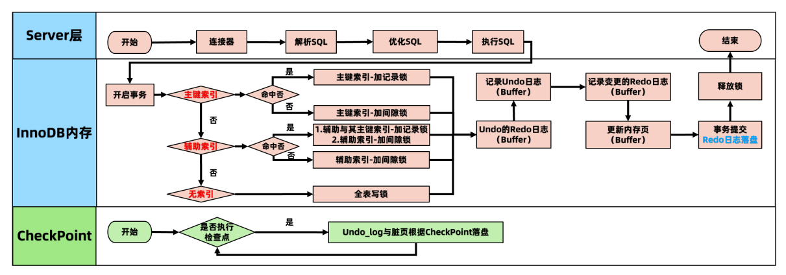
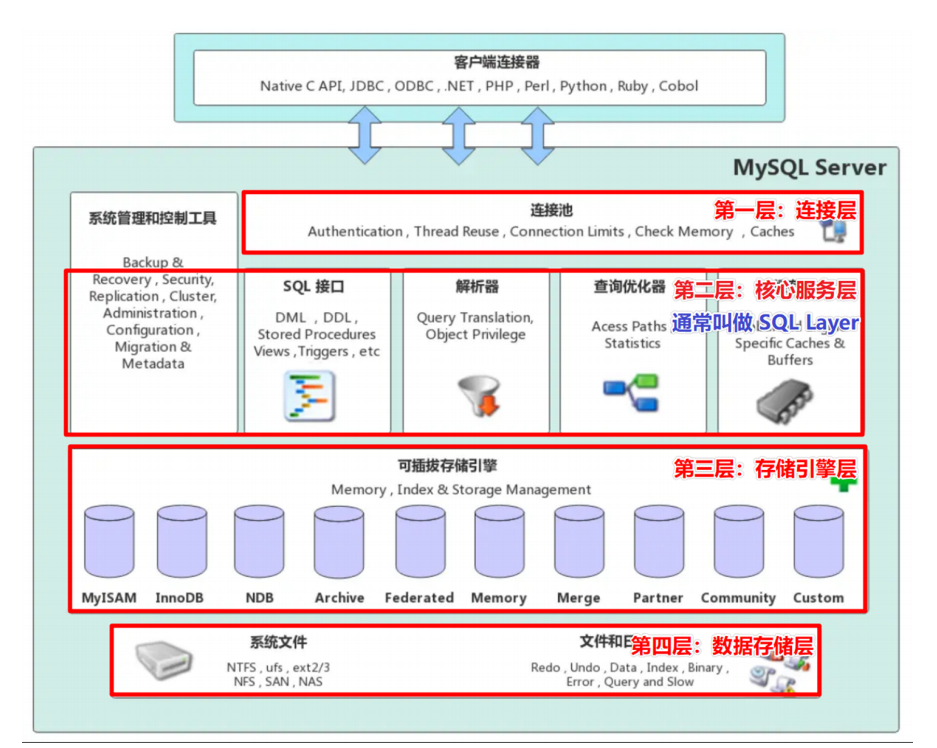
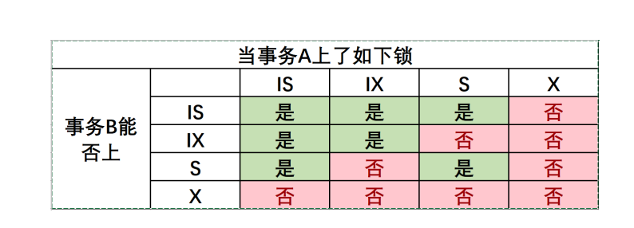
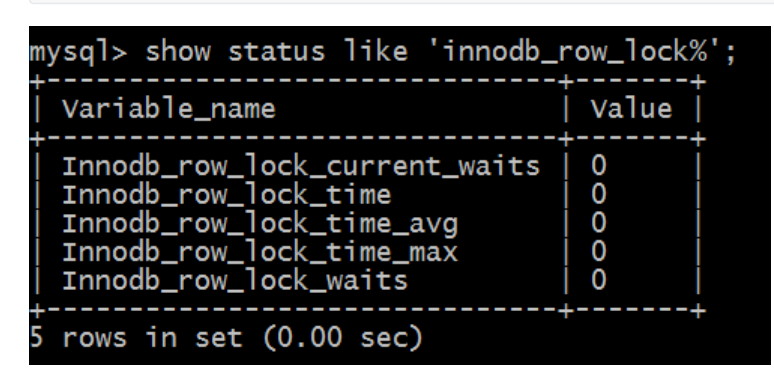

##  一条update语句

```sql
update tab_user set name='曹操' where id = 1;
```



## MySQL锁介绍

在实际的数据库系统中，**每时每刻都在发生着锁**，当某个用户在修改一部分数据时，MySQL会通过锁定防止其他用户读取同一数据。

在处理并发读或者写时，通过由两种类型的锁组成的锁系统来解决问题：**共享锁、排他锁**

## 锁分类

### 按锁粒度分

- 全局锁：锁整个Database，由MySQL的SQL layer层实现

- 表级锁：锁某Table，由MySQL的SQL layer层实现

- 行级锁：锁某Row的索引，也可锁定行索引之间的间隙，由存储引擎实现【InnoDB】

  - 记录锁（Record Locks）：锁定索引中一条记录

  - 间隙锁（Gap Locks）：仅仅锁住一个索引区间

  - 临键锁（Next-Key Locks）：记录锁和间隙锁的组合，**解决幻读问题**

  - 插入意向锁(Insert Intention Locks)：做insert时添加的对记录id的锁

  - 意向锁：存储引擎级别的“表级”锁

### 按锁功能分

- **共享锁（shared lock）也叫S锁、读锁，读锁是共享的，读锁之间互相不阻塞**
  - 加锁方式：select…lock in share mode

- **排他锁（exclusive lock）也叫X锁、写锁，写锁是排他的，写锁阻塞其他的读和写锁**
  - 加锁方式：select…for update



## 全局锁

全局锁是对整个数据库实例加锁，加锁后整个实例就处于只读状态，将阻塞DML、DDL及已经更新但未提交的语句

典型应用：全库逻辑备份

### 加锁与解锁命令

- 加锁命令：flush tables with read lock;
- 释放锁命令：unlock tables;
- 注意：断开Session锁自动释放全局锁

全局锁用于备份这个事情，还是很危险的。因为如果在主库上加全局锁，则整个数据库将不能写入，备份期间影响业务运行，如果在从库上加全局锁，则会导致不能执行主库同步过来的操作，造成主从延迟。


对于innodb这种支持事务的引擎，使用mysqldump备份时可以使用--single-transaction参数，利用mvcc提供一致性视图，而不使用全局锁，不会影响业务的正常运行。而对于有MyISAM这种不支持事务的表，就只能通过全局锁获得一致性视图，对应的mysqldump参数为--lock-all-tables。


## 表级锁

- 表读锁（Table Read Lock），阻塞对当前表的写，但不阻塞读

- 表写锁（Table Write Lock），阻塞对当前表的读和写

- 元数据锁（Meta Data Lock，MDL)不需要显式指定，在访问表时会被自动加上，作用保证读写的正确性

  - 当对表做**增删改查**操作的时**加元数据读锁**

  - 当对表做**结构变更**操作的时**加元数据写锁**

- 自增锁(AUTO-INC Locks) AUTO-INC是一种特殊的表级锁，自增列事务性插入操作时产生

### 表锁相关命令

- 查看表锁定状态：show status like 'table_locks%’;
- 添加表读锁：lock table t read;
- 添加表写锁：lock table t write;
- 查看表锁情况：show open tables;
- 删除表锁：unlock tables;

## 行级锁

## 行级锁简介

- MySQL的行级锁是由存储引擎实现，**InnoDB行锁**是通过给索引上的**索引项加锁来实现**
- 特点：**只有通过索引条件检索的数据InnoDB才使用行级锁，否则InnoDB都将使用表锁**
- **按范围分：**记录锁（Record Locks）、间隙锁（Gap Locks）、临键锁（Next-Key Locks）、插入意向锁（Insert Intention Locks）

- **按功能分：**

  - 读锁：允许事务**去读**目标行，阻止其他事务**更新**。阻止其他事务加写锁，但不阻止加读锁

  - 写锁：允许事务**更新**目标行，阻止其他事务**获取或修改**。同时阻止其他事务加读锁和写锁。

### 如何加行锁

- **对于UPDATE、DELETE和INSERT语句，InnoDB会自动给涉及数据集加写锁；**
- **对于普通SELECT语句，InnoDB不会加任何锁**
- 事务可以通过以下语句手动给记录集加共享锁或排他锁。

#### 添加读锁

```sql
select * from t1_simple where id = 4 lock in share mode;
```

#### 添加写锁

```sql
select * from t1_simple where id = 4 for update;
```

### 行锁四兄弟：记录、间隙、临键和插入意向锁

#### 记录锁（Record Locks）仅仅锁住索引记录的一行

- ⚫ **记录锁锁住的永远是索引，而非记录本身，即使该表上没有任何显示索引**
- ⚫ 没有索引，InnoDB会创建隐藏列ROWID的聚簇索引

```sql
-- 加记录读锁
select * from t1_simple where id = 1 lock in share mode;
-- 加记录写锁
select * from t1_simple where id = 1 for update;
-- 新增，修改，删除加记录写锁
insert into t1_simple values (1, 22);
update t1_simple set pubtime=33 where id =1;
delete from t1_simple where id =1;
```


#### 间隙锁（Gap Locks）仅仅锁住一个索引区间，开区间，不包括双端端点和索引记录

- 在索引记录间隙中加锁，并不包括该索引记录本身
- **间隙锁可用于防止幻读**，保证**索引间隙**不会被插入数据
- 在可重复读（REPEATABLE READ）这个隔离级别下生效。


#### 临键锁（Next-Key Locks）相当于记录锁 + 间隙锁，左开右闭区间

⚫ 默认情况下，InnoDB使用临键锁来锁定记录，但会在不同场景中退化

⚫ 场景01-唯一性字段等值（=）且记录存在，退化为**记录锁**

⚫ 场景02-唯一性字段等值（=）且记录不存在，退化为**间隙锁**

⚫ 场景03-唯一性字段范围（< >），还是**临键锁**

⚫ 场景04-非唯一性字段，默认是**临键锁**

行锁的区间划分图")

#### 插入意向锁(Insert Intention Locks)

- 间隙锁（Gap）可以在一定程度上解决幻读问题，但间隙锁就是最佳方案吗？还有优化空间吗？
- 举个栗子：按照间隙锁的知识分析，此时间隙锁的范围是 (11,99)，意思是这个范围的 id 都不可以插入。如果是这样的话数据插入效率太低，锁范围比较大，很容易发生锁冲突怎么办？
- **插入意向锁就是用来解决这个问题的！**

- 插入意向锁（Insert Intention Locks）是一种在 INSERT 操作之前设置的一种特殊的间隙锁。
- 插入意向锁表示了一种插入意图，即当多个不同的事务，同时往同一个索引的同一个间隙中插入数据的时候，它们互相之间无需等待，即不会阻塞。
- 插入意向锁不会阻止插入意向锁，但是插入意向锁会阻止其他**间隙写锁（排他锁）、记录锁**。

 60 和 70 的记录，每个事务使用插入意向锁锁定 11 和 99 之间的间隙，但是这两个事务不会相互阻塞，因为行是不冲突的！这就是插入意向锁。


## 加锁规则

### 主键索引

- 等值条件，命中，加记录锁
- 等值条件，未命中，加间隙锁
- 范围条件，命中，包含where条件的临键区间，加临键锁
- 范围条件，没有命中，加间隙锁

### 辅助索引

- 等值条件，命中，命中记录的辅助索引项 + 主键索引项加记录锁，辅助索引项两侧加间隙锁
- 等值条件，未命中，加间隙锁
- 范围条件，命中，包含where条件的临键区间加临键锁。命中记录的id索引项加记录锁
- 范围条件，没有命中，加间隙锁

## 意向锁

- 相当于存储引擎级别的表锁，叫做意向锁（Intention Locks），意向锁是InnoDB自动控制不需要手动干预，意向锁和行锁是共存的。主要目标是为了全表更新数据时提升性能
- 表明：“某个事务正在某些行持有了锁、或该事务准备去持有锁”
- 意向锁的存在是为了协调行锁和表锁的关系，支持多粒度（表锁与行锁）的锁并存

举个栗子：

事务A修改user表的记录r，会给记录r上一把行级的**写锁**，同时会给user表上一把**意向写锁（IX）**，这时事务B要给user表上一个表级的**写锁**就会被阻塞。**意向锁**通过这种方式实现了行锁和表锁共存，且满足事务隔离性的要求。

当我们需要加一个写锁时，需要根据意向锁去判断表中有没有数据行被锁定；

1. 如果行锁，则需要遍历每一行数据去确认；
2. 如果表锁，则只需要判断一次即可知道有没数据行被锁定，提升性能。

### 意向锁和读锁、写锁的兼容关系

- 意向锁相互兼容：因为IX、IS只是表明申请更低层次级别元素（比如 page、记录）的X、S操作。
- 表级S锁和X、IX锁不兼容：因为上了表级S锁后，不允许其他事务再加X锁。
- 表级X锁和 IS、IX、S、X不兼容：因为上了表级X锁后，会修改数据。
- 注意：上了行级写锁后，行级写锁不会因为有别的事务上了意向写锁而堵塞，一个MySQL是允许多个行级写锁同时存在的，只要他们不是针对相同的数据行。



## 锁相关参数

InnoDB所使用的**行级锁定**争用状态查看

```sql
mysql> show status like 'innodb_row_lock%';
```



- Innodb_row_lock_current_waits：当前正在等待锁定的数量；
- Innodb_row_lock_time：从系统启动到现在锁定总时间长度；
- Innodb_row_lock_time_avg：每次等待所花平均时间；
- Innodb_row_lock_time_max：从系统启动到现在等待最常的一次所花的时间；
- Innodb_row_lock_waits：系统启动后到现在总共等待的次数；

对于这5个状态变量，比较重要的主要是：

- Innodb_row_lock_time_avg（等待平均时长）
- Innodb_row_lock_waits（等待总次数）
- Innodb_row_lock_time（等待总时长）这三项。

尤其是当等待次数很高，而且每次等待时长也不小的时候，我们就需要分析系统中为什么会有如此多的等待，然后根据分析结果着手指定优化计划。

### 查看事务、锁的sql

```sql
# 查看锁的SQL
select * from information_schema.innodb_locks;
select * from information_schema.innodb_lock_waits;
# 查看事务SQL
select * from information_schema.innodb_trx;
# 查看未关闭的事务详情
SELECT
    a.trx_id,a.trx_state,a.trx_started,a.trx_query,
    b.ID,b.USER,b.DB,b.COMMAND,b.TIME,b.STATE,b.INFO,
    c.PROCESSLIST_USER,c.PROCESSLIST_HOST,c.PROCESSLIST_DB,d.SQL_TEXT
FROM
	information_schema.INNODB_TRX a
LEFT JOIN information_schema.PROCESSLIST b ON a.trx_mysql_thread_id = b.id AND b.COMMAND = 'Sleep'
LEFT JOIN performance_schema.threads c ON b.id = c.PROCESSLIST_ID
LEFT JOIN performance_schema.events_statements_current d ON d.THREAD_ID =c.THREAD_ID;
```

## 行锁分析实战

参考实例

## 死锁

死锁的发生与否，并不在于事务中有多少条SQL语句，【**死锁的关键在于**】：两个(或以上)的Session【加锁的顺序】不一致。

查询最近一次死锁日志

```sql
SHOW ENGINE INNODB STATUS;
```

### 如何避免死锁

MySQL默认会主动探知死锁，并回滚某一个影响最小的事务。等另一事务执行完成之后，再重新执行该事务。

1. 注意程序的逻辑：根本的原因是程序逻辑的顺序交叠，最常见的是交差更新
2. 保持事务的轻量：越是轻量的事务，占有越少的锁资源，这样发生死锁的几率就越小
3. 提高运行的速度：避免使用子查询，尽量使用主键等等
4. 尽量快提交事务，减少持有锁的时间：越早提交事务，锁就越早释放