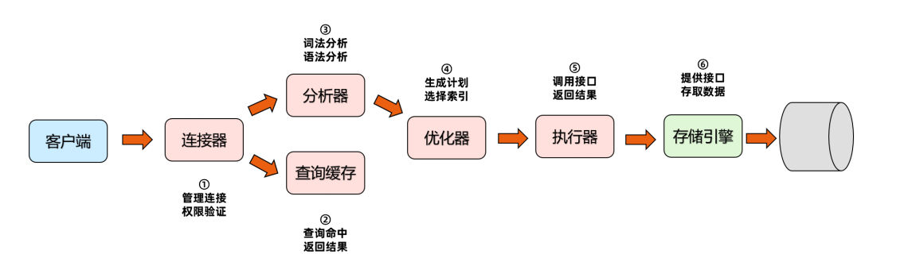

## 逻辑架构图
* Connectors连接器：负责跟客户端建立连接
* Management Serveices & Utilities系统管理和控制工具
* Connection Pool连接池：管理用户连接，监听并接收连接的请求，转发所有连接的请求到线程管理模块
* SQL Interface SQL接口：接受用户的SQL命令，并且返回SQL执行结果
* Parser解析器：SQL传递到解析器的时候会被解析器验证和解析
* Optimizer查询优化器：SQL语句在查询之前会使用查询优化器对查询进行优化，explain语句查看的SQL语句执行计划，就是由此优化器生成
* Cache和Buffer查询缓存：在MySQL5.7中包含缓存组件。在MySQL8中移除了
* Pluggable Storage Engines存储引擎：存储引擎就是存取数据、建立与更新索引、查询数据等技术的实现方法

##  MySQL日志文件
MySQL是通过文件系统对数据索引后进行存储的，MySQL从物理结构上可以分为**日志文件和数据及索引文件**。MySQL在Linux中的数据索引文件和日志文件通常放在/var/lib/mysql目录下。MySQL通过日志记录了数据库操作信息和错误信息。

可以通过命令查看当前数据库中的日志使用信息：
```sql
show variables like 'log_%';
```
### 常用日志文件如下
1. **错误日志**：/var/log/mysql-error.log
2. 二进制日志：/var/lib/mysql/mysql-bin
3. **通用查询日志**：general_query.log
4. **慢查询日志**：slow_query_log.log
5. 事务重做日志：redo log
6. 中继日志：relay log
### 错误日志：error log
默认开启，错误日志记录了运行过程中**遇到的所有严重的错误信息**，以及 MySQL**每次启动和关闭的详细信息**。错误日志所记录的信息是可以通过**log_error和log_warnings配置**来定义的。从5.5.7以后不能关闭错误日志。
* log_error：指定错误日志存储位置
* log-warnings：是否将警告信息输出到错误日志中。
    * log_warnings 为0， 表示不记录告警信息。
    * log_warnings 为1， 表示告警信息写入错误日志。
    * log_warnings 大于1， 表示各类告警信息，例如：有关网络故障的信息和重新连接信息写入错误日志。

```shell
log_error=/var/log/mysql-error.log
log_warnings=2
```

### 二进制日志：bin log
默认关闭，需要通过以下配置进行开启。binlog记录了数据库所有的ddl语句和dml语句，但不包括select语句内容，语句以事件的形式保存，描述了数据的变更顺序binlog还包括了每个更新语句的执行时间信息。如果是DDL语句，则直接记录到binlog日志，而DML语句，必须通过事务提交才能记录到binlog日志中。

* binlog主要用于实现mysql**主从复制、数据备份、数据恢复**。
* 配置中mysql-bin是binlog日志文件的basename，binlog日志文件的完整名称：mysql-bin.000001。
```shell
server_id=42
log-bin=mysql-bin
```
### 通用查询日志：general query log
默认关闭，由于通用查询日志会记录用户的所有操作，其中还包含增删查改等信息，在并发操作大的环下会产生大量的信息从而导致不必要的磁盘IO，会影响MySQL的性能的。

如果不是为了调试数据库，不建议开启查询日志。
```shell
#启动开关
general_log={ON|OFF}
#日志文件变量，而general_log_file如果没有指定，默认名是host_name.log
general_log_file=/var/lib/mysql/host_name.log
```
### 慢查询日志：slow query log
默认关闭，通过以下设置开启。记录执行时间超过long_query_time秒的所有查询，便于收集查询时间比较长的SQL语句。

查看阈值
```sql
show global status like '%Slow_queries%';
show variables like '%slow_query%';
show variables like 'long_query_time%';
```
配置慢查询开启
```
# 开启慢查询日志
slow_query_log=ON
# 慢查询的阈值，单位秒
long_query_time=10
# 日志记录文件
# 如果没有给出file_name值， 默认为主机名，后缀为-slow.log。
# 如果给出了文件名，但不是绝对路径名，文件则写入数据目录。
slow_query_log_file=slow_query_log.log
```
## MySQL数据文件
查看MySQL数据文件
```sql
show variables like '%datadir%';
```
### ibdata文件
使用**系统表空间**存储表数据和索引信息，那么数据存储在一个或多个ibdata文件中
### InnoDB存储引擎的数据文件
* 表名.frm文件：主要存放与表相关的元数据信息，包括：**表结构的定义信息**
* 表名.ibd文件：一张表一个ibd文件，存储表数据和索引信息
### MyISAM存储引擎的数据文件
* 表名.frm文件：主要存放与表相关的元数据信息，包括：**表结构的定义信息**
* 表名.myd文件：主要存放数据
* 表名.myi文件：主要存放索引

## SQL 语言定义
### 数据定义语言：简称DDL(Data Definition Language)
* 作用：用来定义数据库对象：数据库，表，列等。
* 关键字：create，alter，drop等
### 数据操作语言：简称DML(Data Manipulation Language)，
* 作用：用来对数据库中表的记录进行更新。
* 关键字：insert，delete，update等
### 数据查询语言：简称DQL(Data Query Language)
* 作用：用来查询数据库中表的记录。
* 关键字：select，from，where等
### 数据控制语言：简称DCL(Data Control Language)
* 作用：用来定义数据库的访问权限和安全级别，及创建用户。


## 一条SQL语句的完整执行流程
分析SQL语句如下：
```sql
select c_id,first_name,last_name from customer where c_id=14;
```


大体来说，MySQL 可以分为**Server层**和**存储引擎层**两部分：
1. Server层
    * 包括：连接器、查询缓存、分析器、优化器、执行器等
    * 涵盖 MySQL的大多数核心服务功能
    * 所有的内置函数（如日期、时间、数学和加密函数等），所有跨存储引擎的功能都在这一层实现
        * 比如：存储过程、触发器、视图等
2. 存储引擎层：
    * 负责数据的存储和提取
    * 可插拔式存储引擎：InnoDB、MyISAM、Memory 等
    * 最常用存储引擎是InnoDB
    * 从MySQL 5.5版本开始，默认存储引擎是InnoDB

### 简述一条SQL的执行流程
1. 客户端请求
2. 连接到数据库（验证用户身份，给予权限） 
3. 查询缓存（存在缓存则直接返回，不存在则执行后续操作）
    * 为什么不建议使用MySQL的查询缓存？
        * 因为查询缓存往往弊大于利
         * **成本高**：查询缓存的失效非常频繁，只要有对一个表的更新，这个表上所有的查询缓存都会被清空。因此很可能你费劲地把结果存起来，还没使用呢，就被一个更新全清空了。
        * **命中率不高**：对于更新压力大的数据库来说，查询缓存的命中率会非常低。除非你的业务就是有一张静态表，很长时间才会更新一次。比如，一个系统配置表，那这张表上的查询才适合使用查询缓存。
        * **功能并不如专业的缓存工具更好**：redis、memcache、ehcache...
    * 好在 MySQL 也提供了这种按需使用的方式。你可以将参数 query_cache_type 设置成 DEMAND，这样对于默认的 SQL 语句都不使用查询缓存。而对于你确定要使用查询缓存的语句，可以用 SQL_CACHE 显式指定.
    以下是query_cache_type三个参数的含义:
        * query_cache_type=0（OFF）关闭
        * query_cache_type=1（ON）缓存所有结果，除非select语句使用SQL_NO_CACHE禁用查询缓存
        * query_cache_type=2(DEMAND)，只缓存select语句中通过SQL_CACHE指定需要缓存的查询
        * 注意：MySQL 8.0 版本直接将查询缓存的整块功能删掉了*
4. 分析器（对SQL进行词法分析和语法分析操作） 
5. 优化器（优化器顾名思义就是对查询进行优化。作用是根据解析树生成不同的执行计划，然后选择最优的执行计划。） 
6. 执行器（执行时会先看用户是否有执行权限，有才去使用这个引擎提供的接口）
7. 去引擎层获取数据返回（调用存储引擎接口查询）

## 参考文章
* [关系型数据库是如何工作的](https://www.pdai.tech/md/db/sql/sql-db-howitworks.html "关系型数据库是如何工作")