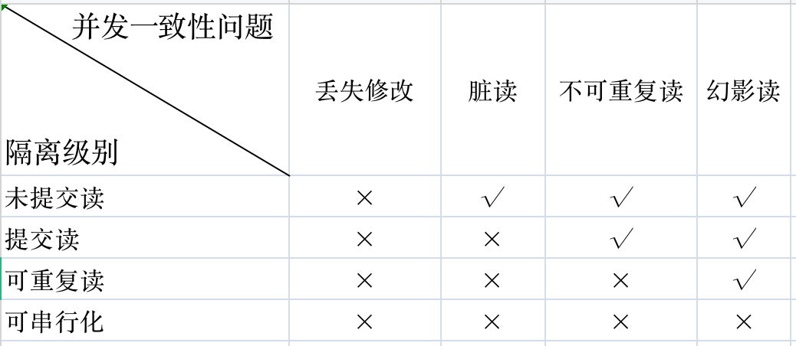

## 事务
> 事务指的是满足 ACID 特性的一组操作，可以通过 Commit 提交一个事务，也可以使用 Rollback 进行回滚。
### ACID特性
#### 原子性(Atomicity) 
事务被视为不可分割的最小单元，事务的所有操作要么全部提交成功，要么全部失败回滚。 回滚可以用日志来实现，日志记录着事务所执行的修改操作，在回滚时反向执行这些修改操作即可。
#### 一致性(Consistency) 
数据库在事务执行前后都保持一致性状态。在一致性状态下，所有事务对一个数据的读取结果都是相同的。 
#### 隔离性(Isolation) 
一个事务所做的修改在最终提交以前，对其它事务是不可见的。
#### 持久性(Durability) 
一旦事务提交，则其所做的修改将会永远保存到数据库中。即使系统发生崩溃，事务执行的结果也不能丢失。 可以通过数据库备份和恢复来实现，在系统发生崩溃时，使用备份的数据库进行数据恢复。

#### ACID特性的相互关系
事务的 ACID 特性概念简单，但不是很好理解，主要是因为这几个特性不是一种平级关系: 
* 只有满足一致性，事务的执行结果才是正确的。 
* 在无并发的情况下，事务串行执行，隔离性一定能够满足。此时只要能满足原子性，就一定能满足一致性。 
* 在并发的情况下，多个事务并行执行，事务不仅要满足原子性，还需要满足隔离性，才能满足一致性。 
* 事务满足持久化是为了能应对数据库崩溃的情况。


### 并发一致性问题
在并发环境下，**事务的隔离性很难保证，因此会出现很多并发一致性问题。**
#### 丢失修改
T1和T2两个事务都对一个数据进行修改，T1先修改，T2随后修改，**T2的修改覆盖了T1的修改**。
#### 读脏数据
T1修改一个数据，T2随后读取这个数据。如果**T1撤销了这次修改，那么T2读取的数据是脏数据。**
#### 不可重复读
**T2读取一个数据，T1对该数据做了修改**。如果T2再次读取这个数据，此时读取的结果和第一次读取的结果不同。
#### 幻影读
**T1读取某个范围的数据，T2在这个范围内插入新的数据，T1再次读取这个范围的数据**，此时读取的结果和和第一次读取的结果不同。
#### 幻读和不可重复读的区别：
* 不可重复读的重点是修改：在同一事务中，同样的条件，第一次读的数据和第二次读的数据不一样。（因为中间有其他事务提交了修改）
* 幻读的重点在于新增或者删除：在同一事务中，同样的条件，第一次和第二次读出来的记录数不一样。（因为中间有其他事务提交了插入/删除）

### 并发一致性的解决方案（引出隔离级别等）
**产生并发不一致性问题主要原因是破坏了事务的隔离性，解决方法是通过并发控制来保证隔离性**。并发控制可以通过封锁来实现，但是**封锁操作**需要用户自己控制，相当复杂。

**数据库管理系统提供了事务的隔离级别，让用户以一种更轻松的方式处理并发一致性问题。**

### 隔离级别 
> 使用select @@tx_isolation;查询数据库的隔离级别。Mysql默认的级别是可重复读，优先考虑把数据库系统的隔离级别设为读已提交。

#### 未提交读(READ UNCOMMITTED) 
读未提交，一个事务可以读到另一个事务未提交的数据！
#### 提交读(READ COMMITTED) 
读已提交，一个事务可以读到另一个事务已提交的数据!
一个事务只能读取已经提交的事务所做的修改。换句话说，一个事务所做的修改在提交之前对其它事务是不可见的。 
#### 可重复读(REPEATABLE READ) 
可重复读，加入间隙锁保证在同一个事务中多次读取同样数据的结果是一样的。
#### 可串行化(SERIALIZABLE) 
串行化，该级别下读写串行化，且所有的select语句后都自动加上lock in share mode，即使用了共享锁。因此在该隔离级别下，使用的是当前读，而不是快照读。

**多版本并发控制是MySQL的InnoDB存储引擎实现隔离级别的一种具体方式**，用于实现**提交读和可重复读这两种隔离级别**。

**而未提交读隔离级别总是读取最新的数据行，无需使用 MVCC。可串行化隔离级别需要对所有读取的行都加锁，单纯使用 MVCC 无法实现。**

MySQL的InnoDB存储引擎**采用两段锁协议，会根据隔离级别在需要的时候自动加锁，并且所有的锁都是在同一时刻被释放**，这被称为隐式锁定。


### 多版本并发控制
> 多版本并发控制(Multi-Version Concurrency Control, MVCC)是 MySQL 的 InnoDB 存储引擎实现隔离级别的一种具体方式，用于实现提交读和可重复读这两种隔离级别。而未提交读隔离级别总是读取最新的数据行，无需使用 MVCC。可串行化隔离级别需要对所有读取的行都加锁，单纯使用 MVCC 无法实现。

#### 版本号 
* 系统版本号: 是一个递增的数字，每开始一个新的事务，系统版本号就会自动递增。 
* 事务版本号: 事务开始时的系统版本号。 

#### 隐藏的列 
MVCC 在每行记录后面都保存着两个隐藏的列，用来存储两个版本号: 
* 创建版本号: 指示创建一个数据行的快照时的系统版本号； 
* 删除版本号: 如果该快照的删除版本号大于当前事务版本号表示该快照有效，否则表示该快照已经被删除了。 

#### Undo 日志 
MVCC 使用到的快照存储在 Undo 日志中，该日志通过回滚指针把一个数据行(Record)的所有快照连接起来。

#### 实现过程
以下实现过程针对可重复读隔离级别。

当开始新一个事务时，该事务的版本号肯定会大于当前所有数据行快照的创建版本号，理解这一点很关键。

1. SELECT 
> 多个事务必须读取到同一个数据行的快照，并且这个快照是距离现在最近的一个有效快照。但是也有例外，如果有一个事务正在修改该数据行，那么它可以读取事务本身所做的修改，而不用和其它事务的读取结果一致。 把没有对一个数据行做修改的事务称为 T，T 所要读取的数据行快照的创建版本号必须小于 T 的版本号，因为如果大于或者等于 T 的版本号，那么表示该数据行快照是其它事务的最新修改，因此不能去读取它。除此之外，T 所要读取的数据行快照的删除版本号必须大于 T 的版本号，因为如果小于等于 T 的版本号，那么表示该数据行快照是已经被删除的，不应该去读取它。 

2. INSERT 
> 将当前系统版本号作为数据行快照的创建版本号。 

3. DELETE 
> 将当前系统版本号作为数据行快照的删除版本号。 

4. UPDATE 
> 将当前系统版本号作为更新前的数据行快照的删除版本号，并将当前系统版本号作为更新后的数据行快照的创建版本号。可以理解为先执行 DELETE 后执行 INSERT。

#### 快照读与当前读
##### 快照读
使用 MVCC 读取的是快照中的数据，这样可以减少加锁所带来的开销。
```sql
select * from table ;
```
##### 当前读
读取的是最新的数据，需要加锁。以下第一个语句需要加 S 锁，其它都需要加 X 锁。
```sql
select * from table where ? lock in share mode; //S锁 (共享锁)
select * from table where ? for update;         //加X锁 (排他锁)
insert;
update;
delete;
```

### 事务的实现
事务的实现是基于数据库的存储引擎。不同的存储引擎对事务的支持程度不一样。MySQL 中支持事务的存储引擎有 InnoDB 和 NDB。

事务的实现就是如何实现ACID特性。**事务的隔离性是通过锁实现，而事务的原子性、一致性和持久性则是通过事务日志实现。**

InnoDB事务日志包括redo log和undo log。
#### redo log（重做日志）
redo log通常是物理日志，记录的是数据页的物理修改，而不是某一行或某几行修改成怎样，它用来恢复提交后的物理数据页。

在InnoDB的存储引擎中，事务日志通过重做(redo)日志和InnoDB存储引擎的日志缓冲(InnoDB Log Buffer)实现。事务开启时，事务中的操作，都会先写入存储引擎的日志缓冲中，在事务提交之前，这些缓冲的日志都需要提前刷新到磁盘上持久化，这就是DBA们口中常说的“日志先行”(Write-Ahead Logging)。当事务提交之后，在Buffer Pool中映射的数据文件才会慢慢刷新到磁盘。此时如果数据库崩溃或者宕机，那么当系统重启进行恢复时，就可以根据redo log中记录的日志，把数据库恢复到崩溃前的一个状态。未完成的事务，可以继续提交，也可以选择回滚，这基于恢复的策略而定。

在系统启动的时候，就已经为redo log分配了一块连续的存储空间，以顺序追加的方式记录Redo Log，通过顺序IO来改善性能。所有的事务共享redo log的存储空间，它们的Redo Log按语句的执行顺序，依次交替的记录在一起。

#### undo log（回滚日志）
undo log是逻辑日志，和redo log记录物理日志的不一样。可以这样认为，当delete一条记录时，undo log中会记录一条对应的insert记录，当update一条记录时，它记录一条对应相反的update记录。

undo log 主要为事务的回滚服务。在事务执行的过程中，除了记录redo log，还会记录一定量的undo log。undo log记录了数据在每个操作前的状态，如果事务执行过程中需要回滚，就可以根据undo log进行回滚操作。单个事务的回滚，只会回滚当前事务做的操作，并不会影响到其他的事务做的操作。

Undo记录的是已部分完成并且写入硬盘的未完成的事务，默认情况下回滚日志是记录在表空间中的（共享表空间或者独享表空间）

二种日志均可以视为一种恢复操作，redo_log是恢复提交事务修改的页操作，而undo_log是回滚行记录到特定版本。二者记录的内容也不同，redo_log是物理日志，记录页的物理修改操作，而undo_log是逻辑日志，根据每行记录进行记录。

#### 事务ACID特性的实现思想
* 原子性：是使用 undo log来实现的，如果事务执行过程中出错或者用户执行了rollback，系统通过undo log日志返回事务开始的状态。
* 持久性：使用 redo log来实现，只要redo log日志持久化了，当系统崩溃，即可通过redo log把数据恢复。
* 隔离性：通过锁以及MVCC,使事务相互隔离开。
* 一致性：通过回滚日志、恢复，以及并发情况下的隔离性，从而实现一致性。

### MySQL 有多少种日志
* 错误日志：记录出错信息，也记录一些警告信息或者正确的信息。
* 查询日志：记录所有对数据库请求的信息，不论这些请求是否得到了正确的执行。
* 慢查询日志：设置一个阈值，将运行时间超过该值的所有SQL语句都记录到慢查询的日志文件中。
* 二进制日志：记录对数据库执行更改的所有操作。
* 中继日志：中继日志也是二进制日志，用来给slave 库恢复
* 事务日志：重做日志redo和回滚日志undo

### MySQL对分布式事务的支持
>下面是简单描述，详细请参考分布式事务。

分布式事务的实现方式有很多，既可以采用 InnoDB 提供的原生的事务支持，也可以采用消息队列来实现分布式事务的最终一致性。这里我们主要聊一下 InnoDB 对分布式事务的支持。

MySQL 从 5.0.3  InnoDB 存储引擎开始支持XA协议的分布式事务。一个分布式事务会涉及多个行动，这些行动本身是事务性的。所有行动都必须一起成功完成，或者一起被回滚。