## **基础知识**

### **什么是事务？**

- 事务指的是逻辑上的一组操作，这组操作的组成单元**要么全都成功，要么全都失败**
- 本质上是个**并发编程问题**
- Client与MySQL建立连接，一个连接开启一次会话Session，每个会话中可以多次开启和提交事务
- 事务由存储引擎实现，MySQL中只有InnoDB支持事务

### **事务四大特性ACID**
- 原子性**A**tomicity：事务最小工作单元，要么全成功，要么全失败
- 一致性**C**onsistency：事务前后数据的完整性必须保持一致
- 隔离性**I**solation：多个用户并发使用数据库时，彼此事务操作数据不能互相干扰，所以要隔离。**隔离性由隔离级别保障**
- 持久性**D**urability：事务一旦提交，它对数据的改变就是永久性的

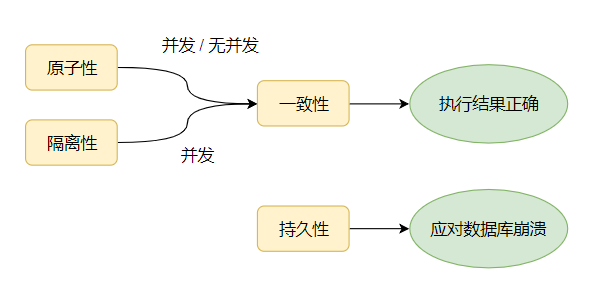

### **事务并发问题**

-  脏读：一个事务读到了另一个事务**未提交**的数据
-  不可重复读：一个事务读到另一个事务**已经Update**的数据。引发事务中的多次查询结果不一致
- 虚读/幻读：一个事务读到另一个事务**已经Insert**的数据。导致事务中多次查询的结果不一致
- **丢失更新的问题！**

### **事务隔离级别**

-  **读未提交RU：**Read Uncommitted，一个事务读到另一个事务没有提交的数据
  - 存在：3个问题：脏读、不可重复读、幻读

-  **读已提交RC：**Read Committed，一个事务读到另一个事务已经提交的数据
  - 存在：2个问题：不可重复读、幻读

-  **可重复读RR：**Repeatable Read，在一个事务中读到的数据始终保持一致，无论另一个事务是否提交
  - 存在：1个问题：幻读

-  **串行化读：**Serializable，同时只能执行一个事务，相当于事务中的单线程。所以啥问题也没有了

#### 对比

**性能：**串行化读 < 可重复读RR < 读已提交RC < 读未提交RU

**安全性：**串行化读 > 可重复读RR > 读已提交RC > 读未提交RU


#### **常见数据库的默认隔离级别**

- MySql： repeatable read
- Oracle： read committed

## **一条Insert语句的执行流程**


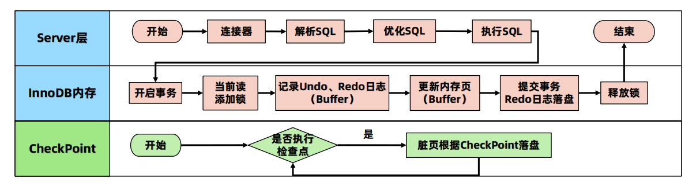

## **事务底层原理详解**

### **丢失更新问题**

两个Session针对同一数据进行修改操作时会存在丢失更新，这个现象称之为丢失更新问题

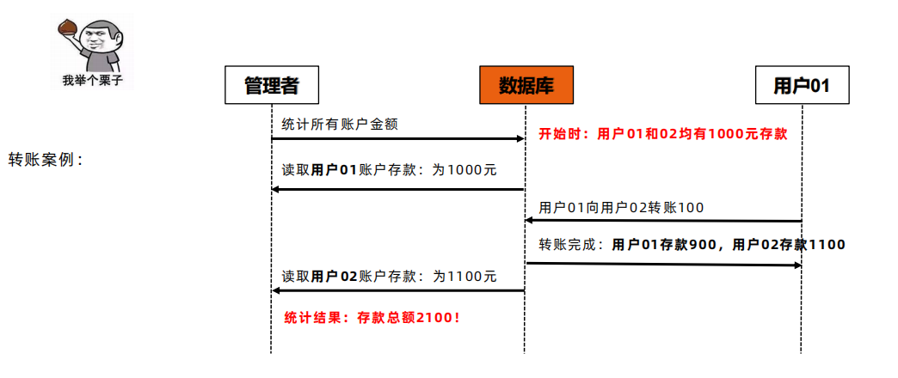

### **如何解决丢失更新问题**


#### 基于锁并发控制LBCC

使用基于锁的并发控制LBCC（Lock Based Concurrency Control），查询总额事务会对读取的行加锁，等到操作结束后再释放所有行上的锁。因为用户A的存款被锁，导致转账操作被阻塞，直到查询总额事务提交并将所有锁都释放。


这种方案比较简单粗暴，就是一个事务去读取一条数据的时候，就上锁，不允许其他事务来操作。假如当前事务只是加**读锁**，那么其他事务就不能有**写锁**，也就是不能修改数据；而假如当前事务需要加**写锁**，那么其他事务就不能持有任何锁。总而言之，能加锁成功，就确保了除了当前事务之外，其他事务不会对当前数据产生影响，所以自然而然的，当前事务读取到的数据就只能是**最新**的，而不会是**快照**数据。


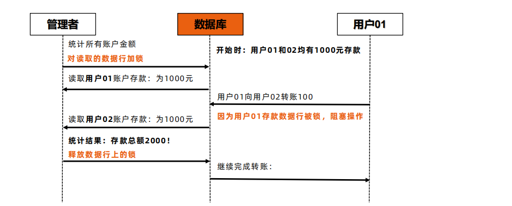


#### 基于版本并发控制**MVCC**

使用版本的并发控制MVCC（Multi Version Concurrency Control）机制也可以解决这个问题。


查询总额事务先读取了用户A的账户存款，然后转账事务会修改用户A和用户B账户存款，查询总额事务读取用户B存款时不会读取转账事务修改后的数据，而是读取本事务开始时的副本数据【快照数据】。

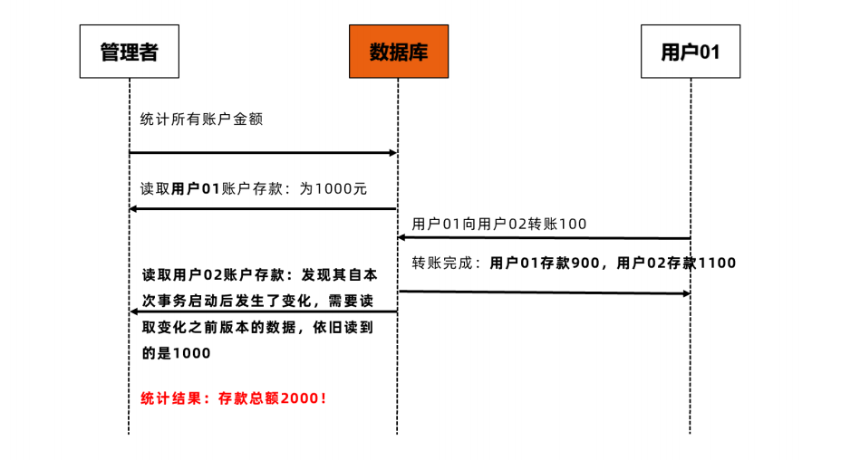


**MVCC 使得普通的SELECT请求不加锁，读写不冲突，显著提高了数据库的并发处理能力**。MVCC保障了ACID中的隔离性


## **MVCC实现原理【InnoDB】**
-  MVCC全称叫多版本并发控制，是RDBMS常用的一种并发控制方法，用来对数据库数据进行并发访问，实现事务。**核心思想：读不加锁，读写不冲突。**
-  实现原理：**数据快照**，不同事务访问数据快照中不同版本的数据
-  MVCC 的实现依赖与**Undo日志 与 Read View**。

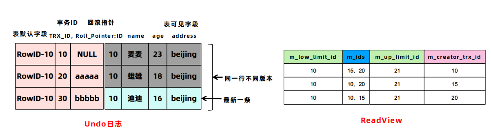

InnoDB下的表有**默认字段**和**可见字段**，默认字段是实现MVCC的关键，默认字段是隐藏的列。默认字段最关键的两个列，**一个保存了行的事务ID，一个保存了行的回滚指针**。每开始新的事务，都会自动递增产生一个新的事务id。事务开始后，生成当前事务影响行的ReadView。当查询时，需要用当前查询的事务id与ReadView确定要查询的数据版本。

###  **事务底层原理-Undo日志**

- Redo日志记录了事务的行为，可以很好地通过其对页进行“重做”操作。但是事务有时还需要进行回滚操作，这时就需要undo。因此在对数据库进行修改时，InnoDB存储引擎不但会产生Redo，还会产生一定量的Undo。这样如果用户执行的事务或语句由于某种原因失败了，又或者用户用一条Rollback语句请求回滚，就可以利用这些undo信息将数据回滚到修改之前的样子。在多事务读取数据时，有了Undo日志可以做到读不加锁，读写不冲突。
- Undo存放在数据库内部的一个特殊段（segment）中，这个段称为Undo段（undo segment）。Undo段位于系统表空间内，也可以设置为Undo表空间。
- Undo日志保存了记录修改前的快照。所以，对于更新和删除操作，InnoDB并不是真正的删除原来的记录，而是设置记录的delete mark为1。因此为了解决数据Page和Undo日志膨胀问题，则需要回收机制进行清理Undo日志。
- 根据行为的不同Undo日志分为两种： Insert Undo Log 和 Update Undo Log

#### Insert Undo日志（是在Insert操作中产生的Undo日志）

Insert 操作的记录只对事务本身可见，对于其它事务此记录是不可见的，所以 Insert Undo Log 可以在事务提交后直接删除而不需要进行回收操作。

```sql
# 事务1
Insert into tab_user(id,name,age,address) values (10,'麦麦',23,'beijing')
```

**Insert into user(id,name,age,address) values (10,'麦麦',23,'beijing')**

**事务01：**初始状态，Insert操作记录只对本事务可见，对其他事务不可见，所以事务提交后直接删除Undo日志无需回收

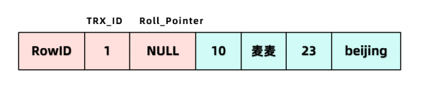


#### Update Undo日志 （是Update或Delete操作中产生的Undo日志）

Update操作会对已经存在的行记录产生影响，为了实现MVCC多版本并发控制机制，因此Update Undo日志不能在事务提交时就删除，而是在事务提交时将日志放入指定区域，等待 Purge 线程进行最后的删除操作。

```sql
# 事务2
update tab_user set name='雄雄',age=18 where id=10;
# 当事务2使用Update语句修改该行数据时，会首先使用写锁锁定目标行，将该行当前的值复制到Undo中，然后再真正地修改当前行的值，最后填写事务ID，使用回滚指针指向Undo中修改前的行。
```

**update** **user set name='雄雄',age=18 where id=10;**

**事务02：**第一次修改，Update操作对已经存在行记录产生影响，为了实现MVCC，修改提交事务后，不能立即删除Update Undo日志而是会将其存入Undo日志链表中，等待Purge线程回收。

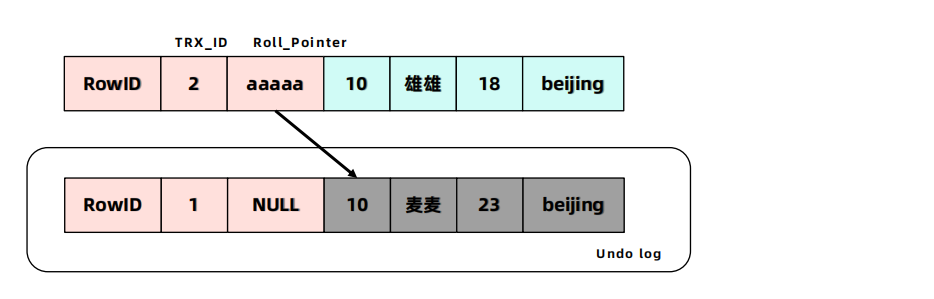

**事务03：**第二次修改

```sql
# 事务3
update tab_user set name='迪迪',age=16 where id=10;
```

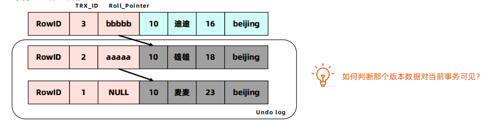

### 事务底层原理-ReadView

**MVCC的核心问题就是：判断一下版本链中的哪个版本是当前事务可见的！**

- 对于使用 RU 隔离级别的事务来说，直接读取记录的最新版本就好了，不需要Undo log。
- 对于使用 串行化 隔离级别的事务来说，使用加锁的方式来访问记录，不需要Undo log。
- 对于使用 RC 和 RR 隔离级别的事务来说，需要用到undo 日志的版本链。

#### 什么是ReadView

ReadView是张存储事务id的表，主要包含当前系统中有哪些活跃的读写事务，把它们的事务id放到一个列表中。结合Undo日志的默认字段【事务trx_id】来控制那个版本的Undo日志可被其他事务看见。

#### 四个列

- **m_ids：**生成ReadView时，当前**活跃的事务id列表**
- **m_low_limit_id：事务id下限**，当前活跃事务中最小的事务id
- **m_up_limit_id：事务id上限**，生成ReadView时，应该分配给下一个事务的id值
- **m_creator_trx_id：**生成该ReadView的事务的事务id

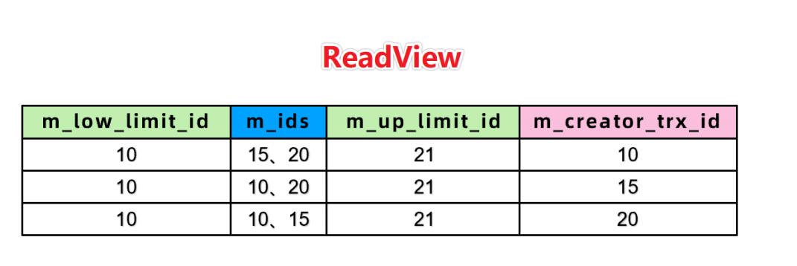

#### 什么时候生成ReadView

开启事务之后，在第一次查询(select)时，生成ReadView

RC 和 RR 隔离级别的差异本质是因为MVCC中ReadView的生成时机不同，详细生成时机在案例中分析

#### 如何判断可见性

- 开启事务执行第一次查询时，首先生成ReadView，然后依据Undo日志和ReadView按照判断可见性
-  判断规则如下
  - 如果被访问版本的 trx_id 属性值，小于ReadView中的**事务下限id**，表明生成该版本的事务在生成 ReadView 前已经提交，所以该版本**可以**被当前事务访问。
  - 如果被访问版本的 trx_id 属性值，等于ReadView中的 m_creator_trx_id ，**可以**被访问。
  - 如果被访问版本的 trx_id 属性值，大于等于ReadView中的**事务上限id**，在生成 ReadView 后才产生的数据，所以该版本**不可以**被当前事务访问。
  - 如果被访问版本的 trx_id 属性值，在**事务下限****id**和**事务上限****id**之间，那就需要判断是不是在m_ids 列表中。
    - 如果在，说明创建 ReadView 时生成该版本的事务还是活跃的，该版本**不可以**被访问；
    - 如果不在，说明创建 ReadView 时生成该版本的事务已经被提交，该版本**可以**被访问。


#### 案例总结

**使用RC隔离级别的事务在每次查询开始时都会生成一个独立的ReadView。**

**MVCC只在RR和RC两个隔离级别下工作。RU和串行化隔离级别不需要 MVCC，为什么？**

- 因为RU总是读取最新的数据行，本身就没有隔离性，也不解决并发潜在问题，因此不需要！
- 而SERIALIZABLE则会对所有读取的行都加锁，相当于串行执行，线程之间绝对隔离，也不需要。


## 事务下的读操作：快照读&当前读

在MVCC并发控制中，读操作可以分成两类：**快照读** **(Snapshot Read)与当前读Current Read)**

- **快照读：**读不加锁，读取的是**版本链**的快照数据，默认的读都是快照读
- **当前读：**读加锁，读取的永远都是最新数据，保证其他事务不会再并发修改这条记录

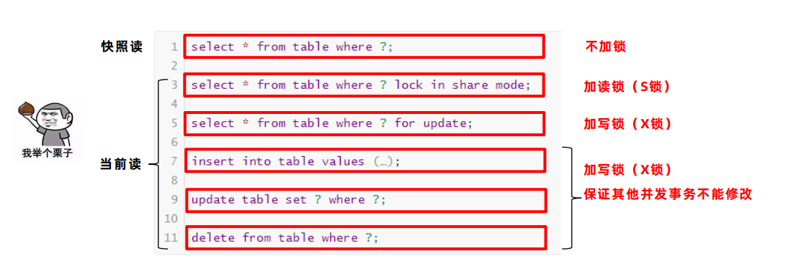

### CRUD的新增、修改、删除操作的具体流程

**当Update SQL操作进入MySQL后：**

1.  MySQL Server根据Where条件，先从InnoDB读回第一条符合条件记录，**当前读**
2.  MySQL Server收到记录，并对记录加写锁
3.  加锁后发起Update操作更新记录
4.  本条记录操作完毕后，接着读取下一条，然后继续上述操作
5.  直到没有满足条件的记录为止
6.  提交事务，释放锁

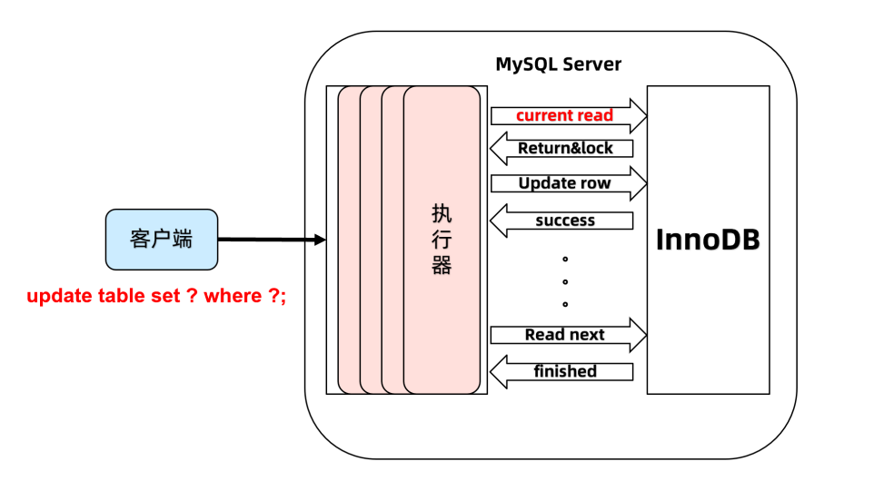

**Delete的操作与Update一样，Insert的操作与Update也差不多，区别：Insert操作会有唯一性约束等规则校验**


## 小结

- MVCC指在使用RC、RR隔离级别下，使不同事务的 读-写 、 写-读 操作并发执行，提升系统性能

- MVCC核心思想是**读不加锁，读写不冲突**。

- RC、RR这两个隔离级别的一个很大不同就是生成 ReadView 的时机不同

  - RC在每一次进行普通 SELECT 操作前都会生成一个 ReadView

  - RR在第一次进行普通 SELECT 操作前生成一个 ReadView ，之后的查询操作都重复这个ReadView
